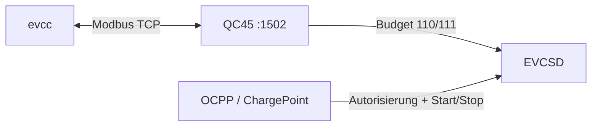

# EVCC Integration

Für die QC45 existiert im Fork `BugUser0815/evcc`, Branch **`QC45`**, ein eigener Treiber `efacec-qc45`.

## Architektur



> [!IMPORTANT]
> **evcc steuert nur die verfügbare Leistung.** Autorisierung und Transaktionsstart/-stopp bleiben im OCPP/EVCSD-Pfad. `Enable()` ist deshalb absichtlich ein No-op und `Enabled()` liefert true.

## Modi

| Modus | Ausgang | Power-Reg. | Budget-Reg. | Maximum |
|---|---|---:|---:|---:|
| `dc` | aktiver CHAdeMO- oder CCS-Ausgang | 100 | 110 | 50 kW |
| `type2` / `ac` | Type2 Connector 3 | 101 | 111 | 43 kW |

## Statusabbildung

Der Treiber bildet die QC45 auf EVCC-Status A/B/C ab:

- **A:** keine aktive EVCSD-Transaktion
- **B:** Transaktion vorhanden, Leistung 0
- **C:** Transaktion vorhanden und Leistung > 0

Bei DC wird Register 4 genutzt, um Connector 1 oder 2 zu erkennen. Der letzte aktive DC-Connector wird gespeichert, damit nach Ende einer Session der passende Energiezähler noch zugeordnet werden kann.

## `MaxCurrent()` → kW

evcc liefert einen Stromsollwert. Der Treiber wandelt ihn in ein dreiphasiges 400-V-Leistungsbudget um:

```text
P_kW = ceil(I_A × √3 × 400 V / 1000)
```

Positive Werte werden auf mindestens 5 kW und das jeweilige Ausgangsmaximum begrenzt. `0 A` schreibt `0 kW`.

Nach einem Neustart arbeitet jeder Ausgang zunächst autonom unter Kontrolle von
LoadManager, KSEM und Failback. Erst der erste evcc-Schreibzugriff auf Register
110 beziehungsweise 111 übernimmt den betreffenden Ausgang. Schreibt evcc
explizit `0`, bleibt dieser Ausgang pausiert; schreibt evcc nichts, kann die
native Regelung ohne evcc laden.

> [!NOTE]
> Diese Umrechnung ist die **EVCC-Schnittstellenanpassung** von Ampere auf das QC45-Leistungsbudget. Sie hat nichts mit dem verworfenen Versuch zu tun, Ampere in EFACEC-CCS-V3-Byte 2 zu schreiben.

## Energie

Die QC45 stellt pro Connector U32-Wh-Zähler bereit:

- C1: 50/51
- C2: 52/53
- C3: 54/55

Der EVCC-Treiber wandelt Wh nach kWh um und implementiert damit `api.MeterEnergy`.

## Dateien

- Treiber: `https://github.com/BugUser0815/evcc/blob/QC45/charger/efacec-qc45.go`
- Template: `https://github.com/BugUser0815/evcc/blob/QC45/templates/definition/charger/efacec-qc45.yaml`

Siehe auch: [Modbus TCP](Modbus-TCP), [LoadManager](LoadManager).
