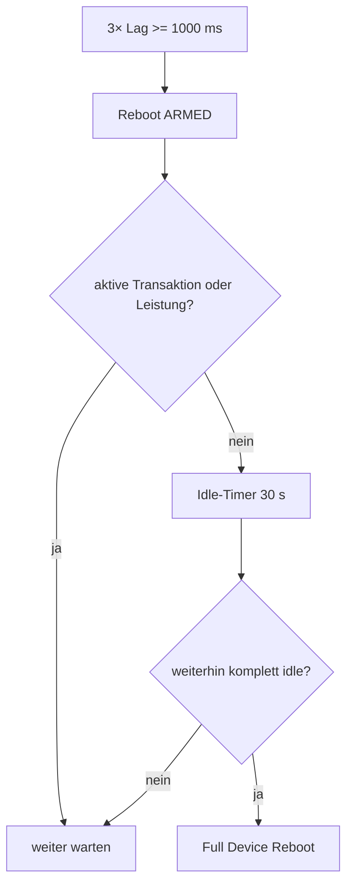

# EVCSD Lag Monitor

Nach beobachteten EVCSD-Hängern bzw. Java-/Executor-Problemen wurde ein leichter Watchdog eingebaut, der die **Warteschlangenlatenz des internen EVCSD-Executors** misst.

## Funktionsweise

Der Monitor sucht per Reflection einen nicht-statischen `Executor` im aktuellen `CentralModule`. In festen Abständen wird eine minimale Marker-Task eingereiht und beim Ausführen die Wartezeit gemessen.

Standardwerte:

| Parameter | Wert |
|---|---:|
| Probe-Intervall | 60 s |
| Warnschwelle | 250 ms |
| Severe Lag | 1000 ms |
| nötig zum Arming | 3 aufeinanderfolgende Severe-Samples |
| Idle vor Reboot | 30 s |
| Aktion | `sudo -n /sbin/reboot` |

## Sicherheitslogik

Ein persistenter Lag löst **nicht sofort** einen Reboot aus.



Damit wird ein Fahrzeug nicht mitten in einer laufenden Session wegen eines Performance-Problems getrennt.

## Warum Full Device Reboot?

Das Problem kann nicht nur im zusätzlichen JAR, sondern im gemeinsamen alten EVCSD/Tomcat-/Treiberzustand liegen. Deshalb wird nach hartnäckigem Executor-Lag bewusst das gesamte Linux-System neu gestartet statt nur einzelne Threads zu ersetzen.

## Voraussetzung

Der EVCSD-Laufzeituser muss den folgenden Befehl ohne Passwort ausführen dürfen:

```text
sudo -n /sbin/reboot
```

Fehlt die Berechtigung, wird der Fehler geloggt und der Prozess nicht mit `System.exit()` beendet.

Quellcode: `https://github.com/BugUser0815/QC45/blob/native-integration/native-integration/src/main/java/de/rothner/qc45/EvcsdLagMonitor.java`
