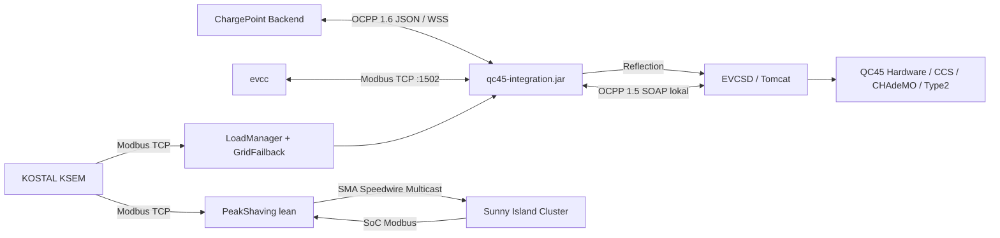

# EFACEC QC45 – Technik-Wiki

> [!NOTE]
> Dieses Wiki dokumentiert den aktuellen technischen Stand der QC45-Integration sowie die dazugehörigen Peak-Shaving- und EVCC-Komponenten. **Produktiv maßgeblich ist der Branch `native-integration`.** Historische Versuche sind separat gekennzeichnet.

## System auf einen Blick

## Betrieb & Integration

| Thema | Zweck | Status |
|---|---|---|
| [Systemarchitektur](Systemarchitektur) | Gesamtaufbau und Datenflüsse | ✅ aktuell |
| [Native Integration](Native-Integration) | JAR im EVCSD/Tomcat, Bootstrap und Reflection | ✅ produktiv |
| [Modbus TCP](Modbus-TCP) | Register, Schreibzugriffe und UI-Daten | ✅ produktiv |
| [EVCC Integration](EVCC-Integration) | eigener QC45-Treiber im EVCC-Fork | ✅ vorhanden |
| [OCPP Bridge](OCPP-Bridge) | OCPP 1.5 SOAP → OCPP 1.6 JSON/WSS | ✅ produktiv |
| [RemoteStart & Autorisierung](RemoteStart-und-Autorisierung) | CCS-RemoteStart-Login-Fix | ✅ aktiv |
| [Konfiguration & Betrieb](Konfiguration-und-Betrieb) | Properties, Ports, Standardwerte | ✅ aktuell |

## Lastmanagement & Speicher

| Thema | Zweck | Status |
|---|---|---|
| [KSEM-Anbindung](KSEM-Anbindung) | Phasenströme und bewusste Kurzzeitverbindungen | ✅ produktiv |
| [LoadManager](LoadManager) | dynamisches DC-Leistungsbudget | ✅ produktiv |
| [Grid-Failback](Grid-Failback) | unabhängige Überstrom-Schutzebene | ✅ produktiv |
| [Peak Shaving & Sunny Island](Peak-Shaving-und-Sunny-Island) | virtuelles SMA Energy Meter | ✅ Branch `lean` |
| [SoC-Derating](SoC-Derating) | sanfte Entladebegrenzung 20 → 11 % SoC | ✅ Branch `lean` |

## CCS & Diagnose

| Thema | Zweck | Status |
|---|---|---|
| [CCS QuickCharge V3](CCS-QuickCharge-V3) | internes EFACEC-Protokoll und `maxPower` | ✅ analysiert |
| [Hyundai Kona – Leistungsbegrenzung](Hyundai-Kona-CCS-Leistungsbegrenzung) | Kona ignoriert wahrscheinlich Power-Limit | 🟠 finale HW-Verifikation offen |
| [CCS Raw Tracing](CCS-Raw-Tracing) | physischer TX/RX-Nachweis | ✅ integriert |
| [Reverse Engineering](Reverse-Engineering) | EVCSD-JAR, AVR-Firmware, A19/EVAcharge | 🟠 fortlaufend |

## UI, Stabilität & Entwicklung

| Thema | Zweck | Status |
|---|---|---|
| [Lademonitor UI](Lademonitor-UI) | kW statt kWh, Ist/Soll, SoC und Sessiondaten | ✅ Modbus-Unterbau; UI als JAR-Artefakt |
| [EVCSD Lag Monitor](EVCSD-Lag-Monitor) | Executor-Lag und sicherer Reboot | ✅ integriert |
| [Build & Installation](Build-und-Installation) | Maven, Deployment, PeakShaving-Build | ✅ dokumentiert |
| [Historie & verworfene Ansätze](Historie-und-verworfene-Ansaetze) | verhindert Wiederholung alter Fehlversuche | ✅ gepflegt |

---

**Stand:** 23.08.2026 · **QC45-Code:** `BugUser0815/QC45` → `native-integration` · **Peak Shaving:** `BugUser0815/PeakShaving` → `lean` · **EVCC:** `BugUser0815/evcc` → `QC45`
