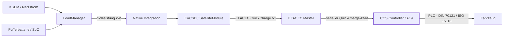

# ⚡ EFACEC QC45 Engineering Wiki

> Technische Wissensbasis für Reverse Engineering, Integration und Lastmanagement der **EFACEC QC45**.
>
> Fokus: EVCSD · QuickCharge · CCS / DIN SPEC 70121 · ISO 15118 · Peak Shaving · Hardware / Firmware

---

## Projektstatus

| Bereich | Stand | Status |
|---|---|---|
| Native Integration | Modbus, LoadManager, Failback und OCPP-Bridge integriert | 🟢 aktiv |
| EFACEC QuickCharge V3 | Paketformat und `maxPower`-Semantik aus Original-EVCSD bestätigt | ✅ bestätigt |
| Kona-Leistungsbegrenzung | Ursache bis auf CCS-HLC-/Controller-Ebene eingegrenzt | 🟠 Analyse |
| CCS-Controller A19 | EVAcharge SE sehr wahrscheinlich, Hardwarebestätigung ausstehend | 🟡 offen |
| `EVSEMaximumCurrentLimit` | wahrscheinlich entscheidender fehlender Regelpfad | 🟠 Analyse |

---

## Einstieg

| Thema | Worum geht es? | Stand |
|---|---|---|
| **[[Hyundai Kona – CCS-Leistungsbegrenzung|Hyundai-Kona-CCS-Leistungsbegrenzung]]** | Warum der Kona trotz 5–6 kW Sollwert deutlich höher lädt und wo die Regelung vermutlich verloren geht | 🟠 Ursache stark eingegrenzt |

---

## Systemüberblick

> [!NOTE]
> Die interne EFACEC-Bezeichnung **CCS V2/V3** ist **nicht** die vom Fahrzeug ausgehandelte DIN-/ISO-Protokollversion. Es handelt sich um die proprietäre Kommunikation innerhalb der QC45.

---

## Aktuell wichtigste Erkenntnisse

### ✅ Bestätigt

- CCS-V3-START transportiert `maxPower` in **kW**.
- Byte 2 des V3-Pakets ist **kein Amperewert**.
- `quickChargeMaxCurrent` wird vom CCS-V3-START-Serializer nicht als separater Stromgrenzwert übertragen.
- Der LoadManager setzt den gewünschten kW-Sollwert auf EVCSD-Seite nachvollziehbar.

### 🟠 Sehr wahrscheinlich

- Die Begrenzung geht erst **hinter der EFACEC-QuickCharge-Schnittstelle** verloren.
- A19 ist sehr wahrscheinlich eine **EVAcharge SE** bzw. ein darauf basierender CCS-Kommunikationscontroller.
- Der Kona reagiert nicht zuverlässig auf `EVSEMaximumPowerLimit`, benötigt aber eine wirksame `EVSEMaximumCurrentLimit`-Vorgabe.

### ⬜ Noch offen

- Aktuelles physisches V3-TX-Paket bei festem 5-kW-Sollwert bestätigen.
- A19-Boardrevision und Firmwarestand erfassen.
- Protokoll zwischen EFACEC-Master und CCS-Controller vollständig rekonstruieren.
- Dynamische Strombegrenzung im HLC-Pfad implementieren.

---

## Evidenzstufen

| Kennzeichnung | Bedeutung |
|---|---|
| ✅ **Bestätigt** | Direkt aus Original-EVCSD, Firmware, Logs oder Primär-/Herstellerdokumentation nachgewiesen |
| 🟠 **Sehr wahrscheinlich** | Mehrere unabhängige Befunde passen zusammen; letzte Hardware-/Live-Bestätigung fehlt |
| ⬜ **Offen** | Muss durch Live-Mitschnitt, Hardwareidentifikation oder weitere Firmwareanalyse verifiziert werden |
| ⛔ **Verworfen** | Ansatz wurde geprüft und ist technisch falsch oder nicht zielführend |

---

## Code & Branches

- **Aktueller Entwicklungsstand:** [`native-integration`](https://github.com/BugUser0815/QC45/tree/native-integration)
- **Native Java-Integration:** [`native-integration/src/main/java/de/rothner/qc45`](https://github.com/BugUser0815/QC45/tree/native-integration/native-integration/src/main/java/de/rothner/qc45)
- **Wiki-Quellen:** [`wiki/`](https://github.com/BugUser0815/QC45/tree/native-integration/wiki)

---

Letzte inhaltliche Aktualisierung: 23.08.2026 · Diese Dokumentation ist eine technische Reverse-Engineering-Dokumentation und keine offizielle EFACEC-Unterlage.
