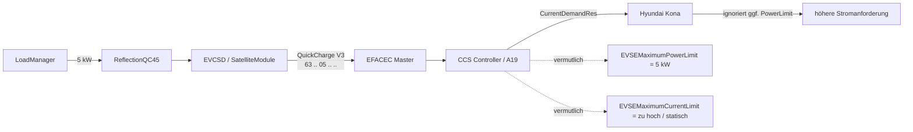

# 🚗 Hyundai Kona und weitere Fahrzeuge – CCS-Leistungsgrenzen

> [!IMPORTANT]
> **Aktueller Hauptverdacht:** Die QC45 setzt die gewünschte Leistung auf EVCSD-/QuickCharge-Ebene korrekt. Der Fehler liegt sehr wahrscheinlich **danach**, auf dem CCS-HLC-Pfad: Der Kona kann `EVSEMaximumPowerLimit` ignorieren, während `EVSEMaximumCurrentLimit` offenbar nicht dynamisch genug reduziert wird.

| | |
|---|---|
| **Status** | 🟠 Ursache stark eingegrenzt |
| **Betroffener Pfad** | EFACEC QC45 → EVCSD → QuickCharge → CCS → DIN SPEC 70121 |
| **Reproduzierbar** | Ja, beim Hyundai Kona |
| **Weitere Fälle** | VW e-Up, MINI SE, BMW iX3, Kia Soul EV, Tesla sowie Stack-/Interop-Fälle dokumentiert |
| **Nächster Beweis** | physisches V3-TX-Paket + A19/CCS-Controller identifizieren |
| **Stand** | 23.08.2026 |

---

## Kurzfassung

Die QC45 bekommt beispielsweise **5 kW Sollleistung** vorgegeben. Auf Java-/EVCSD-Seite bleibt dieser Wert korrekt gesetzt, während der Hyundai Kona trotzdem auf deutlich höhere Ströme und Leistungen hochläuft.

Die bisherigen Analysen ergeben drei zentrale Punkte:

1. **EFACEC QuickCharge V3 transportiert Leistung in kW.** Byte 2 des CCS-START-Pakets ist `maxPower`, nicht Strom.
2. **`quickChargeMaxCurrent` ist im V3-CCS-START wirkungslos.** Der originale Serializer verwendet dieses Feld nicht als separaten Stromgrenzwert.
3. Für den **Hyundai Kona (2019)** ist in einer wissenschaftlichen Untersuchung dokumentiert, dass er `EVSEMaximumPowerLimit` ignorieren kann. Eine direkte Begrenzung über `EVSEMaximumCurrentLimit` wurde dagegen befolgt.

Damit verschiebt sich der Fokus klar vom LoadManager auf den **CCS-Kommunikationscontroller bzw. dessen EFACEC-Adapter**.

---

## Kommunikationskette



> [!NOTE]
> **EFACEC „CCS V2/V3“ und DIN/ISO sind zwei verschiedene Ebenen.** Das interne V2/V3 bezeichnet die proprietäre Kommunikation innerhalb der QC45. Das Fahrzeug selbst kommuniziert anschließend über DIN SPEC 70121 bzw. ISO 15118.

---

## Beobachtetes Verhalten

| Größe | Erwartung | Beobachtung beim Kona |
|---|---:|---:|
| DC-Sollwert | 5–6 kW | 5–6 kW bleibt in EVCSD gesetzt |
| Batteriespannung | ca. 360–365 V | ca. 360–365 V |
| Erwarteter Strom bei 5 kW | ca. 14 A | steigt deutlich darüber |
| Beobachteter Strom | ≤ ca. 14–17 A | >20 A, >40 A, >50 A, teils >70 A |
| Reale Leistung | nahe Sollwert | deutlich >20 kW möglich |
| Folge | stabiles Peak Shaving | Netz-Failback kann auslösen |

> [!WARNING]
> Ein Teil der älteren Logs stammt aus einer **verworfenen Zwischenversion**, in der fälschlich ein berechneter Amperewert in Byte 2 des V3-Pakets geschrieben wurde. Diese Logs beweisen das Hochlaufen des Kona, aber **nicht**, dass der aktuelle korrigierte Stand physisch `05` für 5 kW übertragen hat. Dieser Nachweis steht noch aus.

---

## Befunde auf einen Blick

| Befund | Bewertung |
|---|---|
| V3-START verwendet `maxPower` | ✅ bestätigt |
| Byte 2 ist Leistung in kW | ✅ bestätigt |
| `quickChargeMaxCurrent` begrenzt CCS V3 nicht direkt | ✅ bestätigt |
| LoadManager hält seinen kW-Sollwert | ✅ bestätigt |
| alter EFACEC-Master leitet QuickCharge-Payload weiter | ✅ für analysiertes Firmwareimage |
| A19 ist EVAcharge SE | 🟠 sehr wahrscheinlich |
| Kona ignoriert `EVSEMaximumPowerLimit` | ✅ dokumentierter Präzedenzfall |
| `EVSEMaximumCurrentLimit` bleibt in der QC45 zu hoch | 🟠 Hauptverdacht |
| aktuelle A19-Firmware / Protokollumsetzung | ⬜ noch offen |

---

# 1. Original-EVCSD: Was wird wirklich gesendet?

Analysiert wurden unter anderem:

- `pt.efacec.es.mobie.agent.stationcomponents.comms.quickcharge.QuickChargeSerializer`
- `pt.efacec.es.mobie.agent.stationcomponents.SatelliteModule`
- `MessageStateMachines`

## `SatelliteModule.sendCcsStart()`

Beim CCS-Start baut EVCSD ein `MessageStateMachines`-Objekt auf und setzt unter anderem:

```text
satelliteAction = START_CHARGE
device          = SATELLITE_CCS_CHARGE
current         = quickChargeMaxCurrent
maxPower        = satelliteMaxPower
```

Anschließend wird die Nachricht über `CentralStationComms.send()` verschickt.

## Entscheidend: V3 verwendet `maxPower`

Der originale `QuickChargeSerializer` verwendet für **CCS V3** den Wert aus `MessageStateMachines.maxPower`.

Das resultierende Paket ist fünf Byte lang:

```text
0x63  <flags>  <maxPower_kW>  <CRC16 low/high>
```

Bei 5 kW also sinngemäß:

```text
63 02 05 xx xx
```

oder mit entsprechend gesetztem Status-/Loginbit:

```text
63 82 05 xx xx
```

### Ergebnis

> [!TIP]
> **Byte 2 ist Leistung in kW.** Für 5 kW muss dort `05` stehen. Ein Wert `14` würde 14 kW bedeuten – nicht 14 A.

---

# 2. Warum `quickChargeMaxCurrent` nicht hilft

Obwohl `sendCcsStart()` das Feld `current` setzt, benutzt der CCS-V3-Serializer dieses Feld **nicht** für das START-Paket.

Damit ist der frühere Ansatz verworfen:

```text
5 kW / 361 V ≈ 14 A
```

und anschließend `14` in Byte 2 zu schreiben.

Das ist protokollseitig falsch.

| Ansatz | Ergebnis |
|---|---|
| `Satellite.maxPower = 5` | ✅ korrekt für V3 |
| `quickChargeMaxCurrent = 14` | ⚠️ Feld existiert, wird im V3-CCS-START aber nicht verwendet |
| Byte 2 = `14` | ⛔ falsch, entspricht 14 kW |
| Byte 2 = `05` | ✅ korrekt für 5 kW |

---

# 3. Aktueller Stand im `native-integration`-Branch

## `CcsProtocolV3Enforcer`

Die Integration erzwingt `QCProtocolVersion = 3` an den relevanten EVCSD-/Serializer-Objekten.

➡️ [`CcsProtocolV3Enforcer.java`](https://github.com/BugUser0815/QC45/blob/native-integration/native-integration/src/main/java/de/rothner/qc45/CcsProtocolV3Enforcer.java)

Damit ist ein unbemerkter Rückfall auf das interne EFACEC-V2-Format nach aktuellem Stand **nicht die wahrscheinlichste Ursache**.

## `ReflectionQC45.setConnectorLimitKw()`

Beim Setzen eines DC-Limits werden unter anderem aktualisiert:

- globales DC-Maximum,
- `Satellite.setMaxPower(kw)`,
- `DCMaxPowerFixed`,
- anschließend CCS-START/Refresh.

➡️ [`ReflectionQC45.java`](https://github.com/BugUser0815/QC45/blob/native-integration/native-integration/src/main/java/de/rothner/qc45/ReflectionQC45.java)

## `LoadManager`

Der LoadManager hält einen eigenen autoritativen DC-Sollwert (`commandedDcKw`) und stellt diesen wieder her, wenn EVCSD einen abweichenden Wert meldet.

➡️ [`LoadManager.java`](https://github.com/BugUser0815/QC45/blob/native-integration/native-integration/src/main/java/de/rothner/qc45/LoadManager.java)

**Aktueller Befund:** Es gibt keinen plausiblen LoadManager-Fehler, der einen gesetzten 5-kW-Wert selbstständig in >20 kW verwandelt.

---

# 4. Analyse von `mobie-master.bin`

Im ursprünglichen EVCSD-Paket befindet sich:

```text
evcsd/micro_images/mobie-master.bin
```

**Größe:** 8.960 Byte

## Mikrocontroller

Die Firmwarestruktur und AVR-Vektortabelle passen zu einem **ATmega1280**.

Der ATmega1280 besitzt mehrere UARTs, aber keinen integrierten CAN-Controller. Das untersuchte Master-Image arbeitet auf dieser Ebene also seriell.

## QuickCharge-Weiterleitung

Die Disassemblierung zeigt für den QuickCharge-Gerätepfad, dass der Payload auf einen separaten USART-Kanal weitergereicht wird. In diesem alten Firmwarestand wird der Leistungswert dort nicht in `P/U` umgerechnet.

```text
Linux / EVCSD
      │
      │ proprietäres EFACEC Master-Frame
      ▼
EFACEC Master Controller
      │
      │ serieller QuickCharge-Kanal
      ▼
CCS-Kommunikationscontroller
      │
      │ PLC / DIN 70121 / ISO 15118
      ▼
Fahrzeug
```

> [!CAUTION]
> Das im Softwarepaket enthaltene `mobie-master.bin` ist offenbar **älter als der aktuell geflashte Stand der Säule**. Die Architektur ist damit stark gestützt, aber die aktuelle Master-Firmware ist noch nicht vollständig bewiesen.

---

# 5. A19: sehr wahrscheinlich EVAcharge SE

Öffentliche Ersatzteilinformationen führen die EFACEC-Teilenummer **20090007** als EVAcharge-SE-Board für EFACEC-Ladestationen.

Die EVAcharge SE ist ein EVSE-Kommunikationscontroller für DIN 70121 / ISO 15118 und verfügt je nach Revision unter anderem über:

- Embedded Linux,
- Qualcomm QCA7000 Green PHY,
- Ethernet,
- USB,
- CAN / RS232,
- ECommStack / EVSE-Kommunikationsfunktionen.

### Für diese konkrete QC45 noch zu bestätigen

- [ ] A19 = EFACEC 20090007
- [ ] Boardrevision erfassen
- [ ] Firmwarestand erfassen
- [ ] Aufkleber / Herstellerkennzeichnung fotografieren
- [ ] Verbindung A5 ↔ A19 ↔ A21 dokumentieren

Solange diese Hardwareidentifikation fehlt, ist **EVAcharge SE sehr wahrscheinlich, aber noch nicht endgültig bewiesen**.

---

# 6. Der entscheidende Hyundai-Kona-Befund

Die Publikation *Intelligent Multi-Vehicle DC/DC Charging Station Powered by a Trolley Bus Catenary Grid* (Energies 2021, 14, 8399) untersucht dynamisches Lastmanagement mit realen Serienfahrzeugen unter DIN SPEC 70121.

Dabei wurde dokumentiert:

- `CurrentDemandReq` / `CurrentDemandRes` werden während der aktiven Ladung laufend ausgetauscht.
- `EVSEMaximumPowerLimit` kann als indirekte Leistungsgrenze verwendet werden.
- Einige Fahrzeuge ignorieren diesen Wert.
- Als konkretes Beispiel wird ein **Hyundai Kona (2019)** genannt.
- Eine dynamische Begrenzung über `EVSEMaximumCurrentLimit` wurde von den getesteten Fahrzeugen befolgt.

Das passt auffällig genau zu unserem Fehlerbild.

> [!IMPORTANT]
> Der Kona kann aus Sicht des HLC-Stacks weiterhin hohen Strom anfordern, wenn nur das Power-Limit reduziert wird, aber der direkt wirksame `EVSEMaximumCurrentLimit` hoch bleibt.

---

# 7. Wahrscheinlichste Fehlerursache

Die derzeit plausibelste Umsetzung im CCS-Controller sieht so aus:

```text
LoadManager                 = 5 kW
Satellite.maxPower          = 5
EFACEC V3 Paket             = 63 .. 05 .. ..

CCS Controller:
EVSEMaximumPowerLimit       = 5 kW      ← vermutlich korrekt
EVSEMaximumCurrentLimit     = 125 A     ← vermutlich statisch / zu hoch

Hyundai Kona:
PowerLimit                  = wird ggf. ignoriert
CurrentLimit                = erlaubt weiterhin hohen Strom
```

Damit lassen sich gleichzeitig erklären:

- der korrekte kW-Sollwert in EVCSD,
- das trotzdem steigende CCS-Stromsignal,
- die Wirkungslosigkeit von `quickChargeMaxCurrent` auf Java-Seite,
- das unterschiedliche Verhalten verschiedener Fahrzeuge,
- das Auslösen des Netz-Failbacks trotz kleinem EVCSD-Sollwert.

---

# 8. Ziel der Korrektur

Die gewünschte Leistung muss zusätzlich in einen **dynamischen CCS-Stromgrenzwert** umgesetzt werden:

```text
I_max = P_limit / U_present
```

Beispiel:

```text
P_limit   = 5.000 W
U_present =   365 V
I_max     = 13,70 A
```

Bei ganzzahliger Stromauflösung wäre konservativ beispielsweise:

| Stromlimit | resultierende Leistung bei 365 V |
|---:|---:|
| 13 A | 4,75 kW |
| 14 A | 5,11 kW |

> [!WARNING]
> Diese Umrechnung gehört **nicht** in Byte 2 des EFACEC-V3-Pakets. Dort bleibt weiterhin der kW-Wert. Die Strombegrenzung muss **hinter dieser Schnittstelle** auf dem CCS-Controller bzw. dessen Adapter wirken.

---

# 9. Nächste Verifikation

## 1 · Aktuelles V3-Paket physisch bestätigen

- [ ] Kona anschließen
- [ ] DC-Limit fest auf 5 kW setzen
- [ ] Sollwert während des Tests konstant halten
- [ ] `CcsRawTracerV2` aktivieren
- [ ] reales TX-Paket erfassen
- [ ] Bytefolge mit `... 05 ...` bestätigen

Erwartet:

```text
63 02 05 xx xx
```

oder entsprechend mit gesetzten Flags.

➡️ [`CcsRawTracerV2.java`](https://github.com/BugUser0815/QC45/blob/native-integration/native-integration/src/main/java/de/rothner/qc45/CcsRawTracerV2.java)

## 2 · A19 identifizieren

Benötigt werden Fotos von:

- kompletter Platine,
- Teilenummer,
- Boardrevision,
- Steckverbindern,
- Verbindung zu A5 und A21.

## 3 · CCS-Interface rekonstruieren

Zu klären:

- welche physische Schnittstelle benutzt wird,
- welches Protokoll EFACEC ↔ CCS-Controller läuft,
- ob ein getrenntes `EVSEMaxCurrentLimit` bereits existiert,
- ob EFACEC aktuell nur das Power-Limit setzt.

## 4 · Stromlimit dynamisch setzen

Ziel:

```text
powerLimitKw  = LoadManager-Sollwert
presentVoltage = aktuelle CCS-Spannung
currentLimitA  = powerLimitKw * 1000 / presentVoltage
```

Anschließend muss dieser Wert so in den CCS-Stack gelangen, dass `CurrentDemandRes` einen entsprechend reduzierten `EVSEMaximumCurrentLimit` enthält.

---

# 10. Verworfen oder derzeit nicht sinnvoll

| Ansatz | Bewertung | Grund |
|---|---|---|
| Ampere in V3-Byte 2 schreiben | ⛔ verworfen | Byte 2 ist `maxPower` in kW |
| nur `quickChargeMaxCurrent` ändern | ⛔ nicht ausreichend | V3-Serializer verwendet es nicht im CCS-START |
| auf internes EFACEC CCS V2 wechseln | ⛔ keine Lösung | kein entsprechender dynamischer Leistungswert im analysierten START-Pfad |
| LoadManager neu schreiben | ⛔ derzeit unbegründet | Sollwert wird korrekt gesetzt; Fehler liegt danach |

---

# 11. Dokumentierte Fahrzeug-, Feld- und Stackfälle

Die folgenden Fälle sind nach Beweiskraft getrennt. Nur der Kona- und der e-Up-Befund stammen aus einer veröffentlichten Versuchsreihe, die das Verhalten gegenüber den konkreten HLC-Grenzfeldern beschreibt. GitHub-Issues und Stack-Tests sind technisch nützlich, aber keine Typfreigabe und kein Beleg für das Verhalten aller Fahrzeuge einer Baureihe.

## Evidenzstufen

| Stufe | Bedeutung | Zulässige Aussage |
|---|---|---|
| **A – direkter Fahrzeugtest** | Fahrzeug, Feld und Reaktion sind in einer nachvollziehbaren Versuchsreihe beschrieben | belastbarer Präzedenzfall für das getestete Fahrzeug/Baujahr |
| **B – Feldbericht mit Logbezug** | reales Fahrzeug und Ladevorgang sind dokumentiert, die Kausalität des Limitfelds ist aber nicht isoliert | Hinweis für Reproduktion und Logvergleich |
| **C – Stack, Simulator oder Aggregat** | Softwareverhalten, simuliertes EVCC oder anonymisierte Interoperabilitätsdaten | Architektur- und Diagnosehinweis, kein Fahrzeugnachweis |

## Fallmatrix

| Fahrzeug / System | Jahr / Kontext | Evidenz | Dokumentiertes Verhalten | Aussage für QC45 | Abgrenzung |
|---|---|---:|---|---|---|
| **Hyundai Kona** | Modelljahr 2019, DIN SPEC 70121, veröffentlichter DC-Test | **A** | `EVSEMaximumPowerLimit` wurde ignoriert; dynamisch geänderte `EVSEMaximumCurrentLimit`-Werte wurden in der Versuchsreihe befolgt | Power-Limit allein ist für den Kona kein belastbarer Regler; Stromlimit und Netzteilbegrenzung sind erforderlich | Aussage gilt für das geprüfte Fahrzeug/den damaligen Softwarestand, nicht automatisch für jeden Kona |
| **VW e-Up** | Modelljahr 2019, gleiche Versuchsreihe | **A** | Stromgrenzen unter **5 A** wurden missachtet; deshalb nicht für die Lastmanagement-Validierung verwendet | Sehr kleine Sollleistungen können eine fahrzeugspezifische Mindeststromstrategie oder Ladepause benötigen | Kein Nachweis, dass der e-Up normale Stromgrenzen oberhalb 5 A ignoriert |
| **MINI Cooper SE** | Modelljahr 2020, gleiche Publikation | **A/B** | In der Publikation als Vergleichsfahrzeug und bei Ladeendverläufen gezeigt; nicht als Ausnahme bei dynamischen Stromgrenzen genannt | Positiver Gegenvergleich für dynamische Strombegrenzung und Ladeende | Kein isolierter Nachweis, dass gerade `EVSEMaximumPowerLimit` allein befolgt wird |
| **BMW iX3** | pyPLC/OpenV2Gx-Feldtest, Abbruch nach Charge Parameter Discovery bei 45 % und 80 % SoC | **B** | Im Logkontext stehen 200 A Maximalstrom und 10 kW Maximalleistung; die Verbindung endet bereits nach der Parameterermittlung | Prüffall für CPD-Konsistenz, Einheiten und Statusfelder | Belegt **nicht**, dass der iX3 eines der beiden Limitfelder ignoriert |
| **Kia Soul EV 30 kWh** | Modelljahr 2019, Feldbericht 2026 | **B** | Vergleich: erfolgreiche 49-kW-Sitzung; eine 24-kW-Sitzung endet nach etwa sechs Minuten | Interessanter Regressionsfall für dynamische Leistungs-/Stromänderungen und Abbruchursachen | Issue ist ohne isolierten Grenzfeldtest abgeschlossen; Kausalität offen |
| **Tesla, Modell nicht genannt** | Battery-Emulator-Feldbeobachtung, Fahrzeugsoftware 2024.45.32.2 | **B/C** | Eine Erhöhung von `EVSEMaximumPowerLimit` auf 250 kW löste etwa 6 kW Batterieheizung aus | Das Feld kann Fahrzeug-Nebenverbraucher und Vorkonditionierung beeinflussen, nicht nur den DC-Batteriestrom | Kein Limit-Compliance-Test; Fahrzeugmodell und vollständiger Versuchsaufbau fehlen |
| **EVerest + simuliertes EVCC** | Interop-Lauf 2026 | **C** | EVCC forderte 120 A bei 400 V; die EVSE senkte das Schleifenlimit von 200 A auf 55,2 A, der Simulator las außer dem ResponseCode keine `CurrentDemandRes`-Felder | Zeigt exakt, wie ein EVCC ein dynamisch reduziertes Limit technisch übersehen kann | Simulatorfehler, kein Serienfahrzeug |

## A. Hyundai Kona (2019): direkter Treffer

Die Energies-Publikation beschreibt den für QC45 wichtigsten Präzedenzfall ausdrücklich: Das indirekte Leistungslimit wurde von einzelnen Serienfahrzeugen ignoriert, konkret vom Hyundai Kona (2019). Das direkte Stromlimit wurde von den getesteten Fahrzeugen während der laufenden Ladung auch bei dynamischen Änderungen befolgt. `CurrentDemandReq` und `CurrentDemandRes` wurden dabei ungefähr alle **150–200 ms** ausgetauscht.

Die gleiche Arbeit zeigt außerdem einen auffälligen Kona-Ladeendverlauf um etwa **93 % SoC**: Der Zielstrom kann länger als eine Minute auf ungefähr 2 A fallen und anschließend wieder auf mehr als 40 A steigen. Für die QC45 bedeutet das, dass ein kurzzeitig kleiner Fahrzeugzielstrom nicht als dauerhafte externe Leistungsfreigabe interpretiert werden darf.

**Konsequenz:**

```text
EVSEMaximumPowerLimit = weiterhin korrekt senden
EVSEMaximumCurrentLimit = dynamisch aus Leistung und Istspannung ableiten
Netzteil-Sollwert = zusätzlich unabhängig hart begrenzen
```

## B. VW e-Up (2019): Untergrenze von 5 A

Der e-Up ist der einzige in der Publikation ausdrücklich genannte Ausnahmefall beim dynamischen Stromlimit: Werte unter 5 A wurden nicht beachtet. Die Autoren nahmen das Fahrzeug deshalb nicht in die Validierung des Lastmanagements auf.

Das ist eine andere Fehlerklasse als beim Kona:

- Kona: Power-Limit kann wirkungslos sein, Stromlimit ist der robuste Hebel.
- e-Up: Ein Stromlimit ist grundsätzlich der richtige Hebel, aber extrem kleine Werte können fahrzeugseitig nicht sauber umgesetzt werden.

Für ein 350–400-V-Fahrzeug entsprechen 5 A nur etwa 1,75–2,0 kW. Unterhalb dieses Bereichs sollte QC45 nicht auf eine fein aufgelöste Dauerladung vertrauen, sondern eine definierte Mindestleistung, Pause oder Abschaltung vorsehen.

## C. MINI Cooper SE (2020): positiver Vergleich mit enger Aussagegrenze

Der MINI SE erscheint in der gleichen Arbeit als reales Vergleichsfahrzeug, unter anderem bei den unterschiedlichen Enden von Ladesitzungen. Da die Autoren bei dynamischen Stromlimits nur den VW e-Up als Ausnahme nennen, ist der MINI ein positiver Vergleich für den Stromlimitpfad.

Nicht zulässig wäre daraus die stärkere Aussage abzuleiten, der MINI halte ein isoliertes `EVSEMaximumPowerLimit` sicher ein. Dieser Teil wurde in der Veröffentlichung nicht fahrzeugspezifisch ausgewiesen.

## D. BMW iX3: Abbruch nach Charge Parameter Discovery

Im pyPLC-Issue wird ein BMW iX3 beschrieben, der sowohl bei 45 % als auch bei 80 % SoC nach der Charge Parameter Discovery beendet. Im zugehörigen Logkontext werden `EVSEMaximumCurrentLimit = 200 A` und `EVSEMaximumPowerLimit = 10.000 W` sichtbar.

Dieser Fall ist für QC45 wichtig, weil er zeigt, dass eine scheinbar plausible Kombination aus Strom- und Leistungsgrenze nicht automatisch eine lauffähige Sitzung ergibt. Er beweist jedoch kein Ignorieren der Limits: Der Abbruch liegt vor der stabilen CurrentDemand-Regelung und kann ebenso durch Status-, Einheiten-, Isolations- oder Nachrichtenkonsistenz ausgelöst werden.

## E. Kia Soul EV (2019): 24-kW-Abbruch gegenüber 49-kW-Erfolg

Der Feldbericht stellt zwei reale Sitzungen gegenüber:

- 49 kW: erfolgreich ohne Unterbrechung
- 24 kW: Abbruch nach ungefähr sechs Minuten

Die Diskussion fragt ausdrücklich, ob die 24 kW vom Ladegerät vorgegeben wurden. Ein sauberer A/B-Test von `EVSEMaximumPowerLimit` gegen `EVSEMaximumCurrentLimit` ist aber nicht dokumentiert. Der Fall gehört deshalb in die Regressionsliste, nicht in die Beweiskette gegen ein bestimmtes Feld.

## F. Tesla: Power-Limit beeinflusst Batterieheizung

Im Battery-Emulator-Issue wird für ein nicht näher bezeichnetes Tesla-Fahrzeug mit Software 2024.45.32.2 berichtet, dass eine Erhöhung von `EVSEMaximumPowerLimit` auf 250 kW etwa 6 kW Batterieheizung aktiviert.

Das ist kein Nachweis korrekter Strombegrenzung. Es zeigt aber, dass das kommunizierte Leistungslimit auch die Fahrzeugstrategie und Nebenverbraucher beeinflussen kann. Deshalb sollte QC45 den Power-Wert trotz zusätzlicher Strom- und Netzteilgrenze weiterhin konsistent und wahrheitsgemäß senden.

## G. EVerest und simuliertes EVCC: dieselbe Fehlerform im Labor

Ein dokumentierter Interoperabilitätslauf zeigt:

```text
ChargeParameterDiscoveryRes: EVSEMaximumCurrentLimit = 200 A
CurrentDemandReq:            EVTargetCurrent = 120 A bei 400 V
CurrentDemandRes:            EVSEMaximumCurrentLimit = 55,2 A
```

Das simulierte EVCC verwendete weiterhin seinen konstanten Zielwert und wertete aus `CurrentDemandRes` nur den Antwortcode aus. Dieser reproduzierbare Softwarefehler ist kein Fahrzeugfall, erklärt aber technisch exakt, wie eine während der Ladeschleife abgesenkte Grenze übersehen werden kann.

Auf EVSE-Seite wurde dieses Fehlermuster in EVerest zusätzlich abgefedert: Release-Hinweise nennen den Fix **„Apply EVSE limits on DC target values if EV doesnt update its target values“**. Das ist ein starkes Architekturargument für eine stationsseitige Klammer, unabhängig davon, wie das Fahrzeug reagiert.

## H. Interoperabilität allgemein: CharIN VOLTS 2023

Die öffentliche VOLTS-Auswertung umfasst 174 EV-EVSE-Paarungen und mehr als 1.000 Einzeltests. Die Daten sind anonymisiert und prüfen überwiegend Interoperabilität, ISO-15118-Funktionen und Smart-Charging-Szenarien; sie erlauben keine Zuordnung zu Kona, iX3 oder anderen konkreten Modellen.

Für QC45 ist die Aussage trotzdem relevant: Erfolgreicher Sitzungsstart ist kein Beleg für belastbares dynamisches Lastmanagement. Feld-/PMax-Unterstützung und die korrekte Reaktion auf laufend veränderte Grenzen müssen separat geprüft werden.

## I. Decoder- und Einheitenfehler nicht mit Fahrzeugverhalten verwechseln

Im SmartEVSE/OpenV2Gx-Umfeld wurde zeitweise `EVSEMaximumPowerLimit.Unit = "h"` ausgegeben. Der Fehler wurde durch Aktualisierung des OpenV2Gx-Decoders behoben. Solche Fälle zeigen, warum vor einer Fahrzeugdiagnose immer Rohdaten, EXI-Decoder-Version und physikalische Einheit gegengeprüft werden müssen.

Ein falscher Decoder kann wie eine nicht normkonforme EVSE oder ein wählerisches Fahrzeug aussehen, obwohl lediglich die Darstellung falsch ist.

## J. Robuste Begrenzungslogik für QC45

Die Leistungsgrenze darf nicht nur als HLC-Hinweis existieren. Der an das Netzteil weitergegebene Zielstrom sollte jederzeit durch alle verfügbaren Grenzen geklammert werden:

```text
I_from_power = P_external_limit / EVSEPresentVoltage

I_PSU_target = min(
    EVTargetCurrent,
    EVSEMaximumCurrentLimit,
    I_from_power,
    I_hardware_limit
)
```

Konservative Beispielwerte:

| Istspannung | 5 kW | 10 kW | 15 kW | 20 kW |
|---:|---:|---:|---:|---:|
| 350 V | 14,29 A | 28,57 A | 42,86 A | 57,14 A |
| 375 V | 13,33 A | 26,67 A | 40,00 A | 53,33 A |
| 400 V | 12,50 A | 25,00 A | 37,50 A | 50,00 A |

Bei ganzzahliger Auflösung muss zur sicheren Leistungsbegrenzung abgerundet werden. Rampen, Regelverzögerung, Messfehler und die technisch zulässige Mindeststromgrenze sind zusätzlich zu berücksichtigen.

## K. Verifikationsmatrix für reale Fahrzeuge

| Schritt | Aufzuzeichnen | Bestehenskriterium |
|---|---|---|
| Start / CPD | ausgehandeltes DIN/ISO-Protokoll, EV-Maxima, EVSE-Maxima, Einheiten | Werte sind intern konsistent und korrekt decodiert |
| CurrentDemand-Schleife | `EVTargetCurrent`, `EVTargetVoltage`, `EVSEMaximumCurrentLimit`, `EVSEMaximumPowerLimit`, Present-Werte | jedes dynamische Limit ist zeitlich nachvollziehbar |
| Netzteilpfad | PSU-Sollstrom, PSU-Iststrom, PSU-Istspannung | Sollstrom überschreitet die Min-Klammer nicht |
| Externes Lastmanagement | kW-Budget, KSEM-Werte, Grid-Failback-Zustand | keine Überschreitung des freigegebenen Budgets |
| Abbruch | letzte 30 s aller Ebenen, ResponseCodes, Isolation, CP/PLC | Ursache lässt sich einer Ebene zuordnen |

Empfohlene A/B-Reihe je Fahrzeug:

1. 5, 10, 15 und 20 kW bei möglichst stabiler Batteriespannung.
2. Leistungsänderung während aktiver CurrentDemand-Schleife.
3. Nur Power-Limit ändern und Reaktion protokollieren.
4. Danach Power- und Stromlimit gemeinsam ändern.
5. Physische PSU-Klammer unabhängig prüfen.
6. Ladeende und hohen SoC separat testen.

Zu jedem Lauf gehören synchronisierte Zeitstempel aus LoadManager, Java/EVCSD, EFACEC-QuickCharge-Link, CCS-HLC-Decodierung und Netzteilmessung.

## L. Was aus den Fällen nicht folgt

- Ein Kona-2019-Befund beweist nicht das Verhalten jeder Kona-Generation oder Firmware.
- Der BMW-iX3- und der Kia-Soul-Fall beweisen kein Ignorieren eines bestimmten Limitfelds.
- Der Tesla-Hinweis zeigt Feldwirkung, aber keine Einhaltung einer Leistungsgrenze.
- Ein Stack-Fix oder Simulatorfehler ist kein Serienfahrzeugtest.
- Ein korrekt angezeigter HLC-Wert beweist noch nicht, dass das Netzteil physisch geklammert wird.

Die belastbare Kernaussage bleibt daher eng: **Mindestens ein dokumentierter Hyundai Kona (2019) ignorierte `EVSEMaximumPowerLimit`; ein dynamisches `EVSEMaximumCurrentLimit` ist der besser belegte Fahrzeughebel, und die EVSE muss die physische Ausgangsleistung trotzdem selbst sicher begrenzen.**

---
# 12. Offene Punkte

- [ ] Aktuelles TX-Paket bei 5 kW als `... 05 ...` bestätigen
- [ ] A19 als EFACEC 20090007 / EVAcharge SE bestätigen
- [ ] Boardrevision und Firmwarestand erfassen
- [ ] A5/A19/A21-Verkabelung dokumentieren
- [ ] Protokoll zum CCS-Controller rekonstruieren
- [ ] tatsächliches `EVSEMaximumCurrentLimit` während Kona-Ladung bestimmen
- [ ] dynamische Stromgrenze implementieren
- [ ] Kona mit 5 / 10 / 15 / 20 kW Sollwert testen
- [ ] Gegenprobe mit Mini / Tesla durchführen

---

# Quellen

### EFACEC / Hardware

- [SICOP – EFACEC 20090007 / EVAcharge SE](https://www.sicop.go.cr/moduloBid/common/co/EpSearchItemDetail.jsp?page_no=142422)
- [chargebyte – EVAcharge SE](https://chargebyte.com/products/controllers-modules/evse-controllers/evacharge-se)
- [EVAcharge SE BSP – Networking / Interfaces](https://evacharge-se-bsp.readthedocs.io/en/latest/networking.html)

### CCS / DIN SPEC 70121

- [CharIN – Technical Details CCS](https://www.charin.global/technology/technical-details-ccs-basic/)
- [CharIN Guideline for DC CCS 1.0 Implementation](https://www.charin.global/media/pages/home/technical-details-ccs-basic/b70e776669-1645622498/ccs_guideline_v1p6.pdf)

### Hyundai Kona / Power- vs. Current-Limit

- [Weisbach et al. – Intelligent Multi-Vehicle DC/DC Charging Station Powered by a Trolley Bus Catenary Grid](https://www.mdpi.com/1996-1073/14/24/8399)

### Weitere Fahrzeug-, Stack- und Interoperabilitätsfälle

- [uhi22/pyPLC #14 – BMW iX3: Abbruch nach Charge Parameter Discovery](https://github.com/uhi22/pyPLC/issues/14)
- [osexpert/ccs32clara-chademo #54 – Kia Soul EV (2019): 24-kW-Abbruch](https://github.com/osexpert/ccs32clara-chademo/issues/54)
- [dalathegreat/Battery-Emulator #202 – Tesla: Power-Limit und Batterieheizung](https://github.com/dalathegreat/Battery-Emulator/issues/202)
- [EVerest Releases – EVSE-Limits auf DC-Zielwerte anwenden, Fix #1893](https://github.com/EVerest/EVerest/releases)
- [OpenChargingCloud – Interop-Lauf mit dynamischem 200-A-→-55,2-A-Limit](https://github.com/OpenChargingCloud/ISO15118ConformanceTests/blob/master/docs/interop-runs/2026-08-10-everest-session-log-lengths/notes.md)
- [SmartEVSE-3 #25 – OpenV2Gx-Decoder/Einheitenfehler](https://github.com/SmartEVSE/SmartEVSE-3/issues/25?timeline_page=2)
- [CharIN VOLTS 2023 – öffentliche Interoperabilitätsdaten](https://www.charin.global/events/volts-2023)
- [ISO-15118-2-XSD – optionale MaximumCurrent/MaximumPower-Felder](https://github.com/FlUxIuS/V2Gdecoder/blob/master/schemas/V2G_CI_MsgBody.xsd)

---

## Fazit

> **Der LoadManager ist nach aktuellem Kenntnisstand nicht der Hauptfehler.** Die QC45 transportiert den kW-Sollwert korrekt bis zur proprietären EFACEC-V3-Schnittstelle. Der wahrscheinlichste Fehler liegt danach: Der CCS-Controller muss zusätzlich einen dynamisch passenden `EVSEMaximumCurrentLimit` an das Fahrzeug kommunizieren.

[[← Zurück zur Startseite|Home]]
