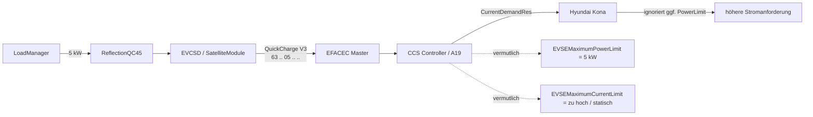

# 🚗 Hyundai Kona – CCS-Leistungsbegrenzung wird ignoriert

> [!IMPORTANT]
> **Aktueller Hauptverdacht:** Die QC45 setzt die gewünschte Leistung auf EVCSD-/QuickCharge-Ebene korrekt. Der Fehler liegt sehr wahrscheinlich **danach**, auf dem CCS-HLC-Pfad: Der Kona kann `EVSEMaximumPowerLimit` ignorieren, während `EVSEMaximumCurrentLimit` offenbar nicht dynamisch genug reduziert wird.

| | |
|---|---|
| **Status** | 🟠 Ursache stark eingegrenzt |
| **Betroffener Pfad** | EFACEC QC45 → EVCSD → QuickCharge → CCS → DIN SPEC 70121 |
| **Reproduzierbar** | Ja, beim Hyundai Kona |
| **Andere Fahrzeuge** | Tesla Model Y / Mini Cooper SE zeigten dieses Verhalten nicht |
| **Nächster Beweis** | physisches V3-TX-Paket + A19/CCS-Controller identifizieren |
| **Stand** | 23.08.2026 |

---

## Kurzfassung

Die QC45 bekommt beispielsweise **5 kW Sollleistung** vorgegeben. Auf Java-/EVCSD-Seite bleibt dieser Wert korrekt gesetzt, während der Hyundai Kona trotzdem auf deutlich höhere Ströme und Leistungen hochläuft.

Die bisherigen Analysen ergeben drei zentrale Punkte:

1. **EFACEC QuickCharge V3 transportiert Leistung in kW.** Byte 2 des CCS-START-Pakets ist `maxPower`, nicht Strom.
2. **`quickChargeMaxCurrent` ist im V3-CCS-START wirkungslos.** Der originale Serializer verwendet dieses Feld nicht als separaten Stromgrenzwert.
3. Für den **Hyundai Kona (2019)** ist in einer wissenschaftlichen Untersuchung dokumentiert, dass er `EVSEMaximumPowerLimit` ignorieren kann. Eine direkte Begrenzung über `EVSEMaximumCurrentLimit` wurde dagegen befolgt.

Damit verschiebt sich der Fokus klar vom LoadManager auf den **CCS-Kommunikationscontroller bzw. dessen EFACEC-Adapter**.

---

## Kommunikationskette



> [!NOTE]
> **EFACEC „CCS V2/V3“ und DIN/ISO sind zwei verschiedene Ebenen.** Das interne V2/V3 bezeichnet die proprietäre Kommunikation innerhalb der QC45. Das Fahrzeug selbst kommuniziert anschließend über DIN SPEC 70121 bzw. ISO 15118.

---

## Beobachtetes Verhalten

| Größe | Erwartung | Beobachtung beim Kona |
|---|---:|---:|
| DC-Sollwert | 5–6 kW | 5–6 kW bleibt in EVCSD gesetzt |
| Batteriespannung | ca. 360–365 V | ca. 360–365 V |
| Erwarteter Strom bei 5 kW | ca. 14 A | steigt deutlich darüber |
| Beobachteter Strom | ≤ ca. 14–17 A | >20 A, >40 A, >50 A, teils >70 A |
| Reale Leistung | nahe Sollwert | deutlich >20 kW möglich |
| Folge | stabiles Peak Shaving | Netz-Failback kann auslösen |

> [!WARNING]
> Ein Teil der älteren Logs stammt aus einer **verworfenen Zwischenversion**, in der fälschlich ein berechneter Amperewert in Byte 2 des V3-Pakets geschrieben wurde. Diese Logs beweisen das Hochlaufen des Kona, aber **nicht**, dass der aktuelle korrigierte Stand physisch `05` für 5 kW übertragen hat. Dieser Nachweis steht noch aus.

---

## Befunde auf einen Blick

| Befund | Bewertung |
|---|---|
| V3-START verwendet `maxPower` | ✅ bestätigt |
| Byte 2 ist Leistung in kW | ✅ bestätigt |
| `quickChargeMaxCurrent` begrenzt CCS V3 nicht direkt | ✅ bestätigt |
| LoadManager hält seinen kW-Sollwert | ✅ bestätigt |
| alter EFACEC-Master leitet QuickCharge-Payload weiter | ✅ für analysiertes Firmwareimage |
| A19 ist EVAcharge SE | 🟠 sehr wahrscheinlich |
| Kona ignoriert `EVSEMaximumPowerLimit` | ✅ dokumentierter Präzedenzfall |
| `EVSEMaximumCurrentLimit` bleibt in der QC45 zu hoch | 🟠 Hauptverdacht |
| aktuelle A19-Firmware / Protokollumsetzung | ⬜ noch offen |

---

# 1. Original-EVCSD: Was wird wirklich gesendet?

Analysiert wurden unter anderem:

- `pt.efacec.es.mobie.agent.stationcomponents.comms.quickcharge.QuickChargeSerializer`
- `pt.efacec.es.mobie.agent.stationcomponents.SatelliteModule`
- `MessageStateMachines`

## `SatelliteModule.sendCcsStart()`

Beim CCS-Start baut EVCSD ein `MessageStateMachines`-Objekt auf und setzt unter anderem:

```text
satelliteAction = START_CHARGE
device          = SATELLITE_CCS_CHARGE
current         = quickChargeMaxCurrent
maxPower        = satelliteMaxPower
```

Anschließend wird die Nachricht über `CentralStationComms.send()` verschickt.

## Entscheidend: V3 verwendet `maxPower`

Der originale `QuickChargeSerializer` verwendet für **CCS V3** den Wert aus `MessageStateMachines.maxPower`.

Das resultierende Paket ist fünf Byte lang:

```text
0x63  <flags>  <maxPower_kW>  <CRC16 low/high>
```

Bei 5 kW also sinngemäß:

```text
63 02 05 xx xx
```

oder mit entsprechend gesetztem Status-/Loginbit:

```text
63 82 05 xx xx
```

### Ergebnis

> [!TIP]
> **Byte 2 ist Leistung in kW.** Für 5 kW muss dort `05` stehen. Ein Wert `14` würde 14 kW bedeuten – nicht 14 A.

---

# 2. Warum `quickChargeMaxCurrent` nicht hilft

Obwohl `sendCcsStart()` das Feld `current` setzt, benutzt der CCS-V3-Serializer dieses Feld **nicht** für das START-Paket.

Damit ist der frühere Ansatz verworfen:

```text
5 kW / 361 V ≈ 14 A
```

und anschließend `14` in Byte 2 zu schreiben.

Das ist protokollseitig falsch.

| Ansatz | Ergebnis |
|---|---|
| `Satellite.maxPower = 5` | ✅ korrekt für V3 |
| `quickChargeMaxCurrent = 14` | ⚠️ Feld existiert, wird im V3-CCS-START aber nicht verwendet |
| Byte 2 = `14` | ⛔ falsch, entspricht 14 kW |
| Byte 2 = `05` | ✅ korrekt für 5 kW |

---

# 3. Aktueller Stand im `native-integration`-Branch

## `CcsProtocolV3Enforcer`

Die Integration erzwingt `QCProtocolVersion = 3` an den relevanten EVCSD-/Serializer-Objekten.

➡️ [`CcsProtocolV3Enforcer.java`](https://github.com/BugUser0815/QC45/blob/native-integration/native-integration/src/main/java/de/rothner/qc45/CcsProtocolV3Enforcer.java)

Damit ist ein unbemerkter Rückfall auf das interne EFACEC-V2-Format nach aktuellem Stand **nicht die wahrscheinlichste Ursache**.

## `ReflectionQC45.setConnectorLimitKw()`

Beim Setzen eines DC-Limits werden unter anderem aktualisiert:

- globales DC-Maximum,
- `Satellite.setMaxPower(kw)`,
- `DCMaxPowerFixed`,
- anschließend CCS-START/Refresh.

➡️ [`ReflectionQC45.java`](https://github.com/BugUser0815/QC45/blob/native-integration/native-integration/src/main/java/de/rothner/qc45/ReflectionQC45.java)

## `LoadManager`

Der LoadManager hält einen eigenen autoritativen DC-Sollwert (`commandedDcKw`) und stellt diesen wieder her, wenn EVCSD einen abweichenden Wert meldet.

➡️ [`LoadManager.java`](https://github.com/BugUser0815/QC45/blob/native-integration/native-integration/src/main/java/de/rothner/qc45/LoadManager.java)

**Aktueller Befund:** Es gibt keinen plausiblen LoadManager-Fehler, der einen gesetzten 5-kW-Wert selbstständig in >20 kW verwandelt.

---

# 4. Analyse von `mobie-master.bin`

Im ursprünglichen EVCSD-Paket befindet sich:

```text
evcsd/micro_images/mobie-master.bin
```

**Größe:** 8.960 Byte

## Mikrocontroller

Die Firmwarestruktur und AVR-Vektortabelle passen zu einem **ATmega1280**.

Der ATmega1280 besitzt mehrere UARTs, aber keinen integrierten CAN-Controller. Das untersuchte Master-Image arbeitet auf dieser Ebene also seriell.

## QuickCharge-Weiterleitung

Die Disassemblierung zeigt für den QuickCharge-Gerätepfad, dass der Payload auf einen separaten USART-Kanal weitergereicht wird. In diesem alten Firmwarestand wird der Leistungswert dort nicht in `P/U` umgerechnet.

```text
Linux / EVCSD
      │
      │ proprietäres EFACEC Master-Frame
      ▼
EFACEC Master Controller
      │
      │ serieller QuickCharge-Kanal
      ▼
CCS-Kommunikationscontroller
      │
      │ PLC / DIN 70121 / ISO 15118
      ▼
Fahrzeug
```

> [!CAUTION]
> Das im Softwarepaket enthaltene `mobie-master.bin` ist offenbar **älter als der aktuell geflashte Stand der Säule**. Die Architektur ist damit stark gestützt, aber die aktuelle Master-Firmware ist noch nicht vollständig bewiesen.

---

# 5. A19: sehr wahrscheinlich EVAcharge SE

Öffentliche Ersatzteilinformationen führen die EFACEC-Teilenummer **20090007** als EVAcharge-SE-Board für EFACEC-Ladestationen.

Die EVAcharge SE ist ein EVSE-Kommunikationscontroller für DIN 70121 / ISO 15118 und verfügt je nach Revision unter anderem über:

- Embedded Linux,
- Qualcomm QCA7000 Green PHY,
- Ethernet,
- USB,
- CAN / RS232,
- ECommStack / EVSE-Kommunikationsfunktionen.

### Für diese konkrete QC45 noch zu bestätigen

- [ ] A19 = EFACEC 20090007
- [ ] Boardrevision erfassen
- [ ] Firmwarestand erfassen
- [ ] Aufkleber / Herstellerkennzeichnung fotografieren
- [ ] Verbindung A5 ↔ A19 ↔ A21 dokumentieren

Solange diese Hardwareidentifikation fehlt, ist **EVAcharge SE sehr wahrscheinlich, aber noch nicht endgültig bewiesen**.

---

# 6. Der entscheidende Hyundai-Kona-Befund

Die Publikation *Intelligent Multi-Vehicle DC/DC Charging Station Powered by a Trolley Bus Catenary Grid* (Energies 2021, 14, 8399) untersucht dynamisches Lastmanagement mit realen Serienfahrzeugen unter DIN SPEC 70121.

Dabei wurde dokumentiert:

- `CurrentDemandReq` / `CurrentDemandRes` werden während der aktiven Ladung laufend ausgetauscht.
- `EVSEMaximumPowerLimit` kann als indirekte Leistungsgrenze verwendet werden.
- Einige Fahrzeuge ignorieren diesen Wert.
- Als konkretes Beispiel wird ein **Hyundai Kona (2019)** genannt.
- Eine dynamische Begrenzung über `EVSEMaximumCurrentLimit` wurde von den getesteten Fahrzeugen befolgt.

Das passt auffällig genau zu unserem Fehlerbild.

> [!IMPORTANT]
> Der Kona kann aus Sicht des HLC-Stacks weiterhin hohen Strom anfordern, wenn nur das Power-Limit reduziert wird, aber der direkt wirksame `EVSEMaximumCurrentLimit` hoch bleibt.

---

# 7. Wahrscheinlichste Fehlerursache

Die derzeit plausibelste Umsetzung im CCS-Controller sieht so aus:

```text
LoadManager                 = 5 kW
Satellite.maxPower          = 5
EFACEC V3 Paket             = 63 .. 05 .. ..

CCS Controller:
EVSEMaximumPowerLimit       = 5 kW      ← vermutlich korrekt
EVSEMaximumCurrentLimit     = 125 A     ← vermutlich statisch / zu hoch

Hyundai Kona:
PowerLimit                  = wird ggf. ignoriert
CurrentLimit                = erlaubt weiterhin hohen Strom
```

Damit lassen sich gleichzeitig erklären:

- der korrekte kW-Sollwert in EVCSD,
- das trotzdem steigende CCS-Stromsignal,
- die Wirkungslosigkeit von `quickChargeMaxCurrent` auf Java-Seite,
- das unterschiedliche Verhalten verschiedener Fahrzeuge,
- das Auslösen des Netz-Failbacks trotz kleinem EVCSD-Sollwert.

---

# 8. Ziel der Korrektur

Die gewünschte Leistung muss zusätzlich in einen **dynamischen CCS-Stromgrenzwert** umgesetzt werden:

```text
I_max = P_limit / U_present
```

Beispiel:

```text
P_limit   = 5.000 W
U_present =   365 V
I_max     = 13,70 A
```

Bei ganzzahliger Stromauflösung wäre konservativ beispielsweise:

| Stromlimit | resultierende Leistung bei 365 V |
|---:|---:|
| 13 A | 4,75 kW |
| 14 A | 5,11 kW |

> [!WARNING]
> Diese Umrechnung gehört **nicht** in Byte 2 des EFACEC-V3-Pakets. Dort bleibt weiterhin der kW-Wert. Die Strombegrenzung muss **hinter dieser Schnittstelle** auf dem CCS-Controller bzw. dessen Adapter wirken.

---

# 9. Nächste Verifikation

## 1 · Aktuelles V3-Paket physisch bestätigen

- [ ] Kona anschließen
- [ ] DC-Limit fest auf 5 kW setzen
- [ ] Sollwert während des Tests konstant halten
- [ ] `CcsRawTracerV2` aktivieren
- [ ] reales TX-Paket erfassen
- [ ] Bytefolge mit `... 05 ...` bestätigen

Erwartet:

```text
63 02 05 xx xx
```

oder entsprechend mit gesetzten Flags.

➡️ [`CcsRawTracerV2.java`](https://github.com/BugUser0815/QC45/blob/native-integration/native-integration/src/main/java/de/rothner/qc45/CcsRawTracerV2.java)

## 2 · A19 identifizieren

Benötigt werden Fotos von:

- kompletter Platine,
- Teilenummer,
- Boardrevision,
- Steckverbindern,
- Verbindung zu A5 und A21.

## 3 · CCS-Interface rekonstruieren

Zu klären:

- welche physische Schnittstelle benutzt wird,
- welches Protokoll EFACEC ↔ CCS-Controller läuft,
- ob ein getrenntes `EVSEMaxCurrentLimit` bereits existiert,
- ob EFACEC aktuell nur das Power-Limit setzt.

## 4 · Stromlimit dynamisch setzen

Ziel:

```text
powerLimitKw  = LoadManager-Sollwert
presentVoltage = aktuelle CCS-Spannung
currentLimitA  = powerLimitKw * 1000 / presentVoltage
```

Anschließend muss dieser Wert so in den CCS-Stack gelangen, dass `CurrentDemandRes` einen entsprechend reduzierten `EVSEMaximumCurrentLimit` enthält.

---

# 10. Verworfen oder derzeit nicht sinnvoll

| Ansatz | Bewertung | Grund |
|---|---|---|
| Ampere in V3-Byte 2 schreiben | ⛔ verworfen | Byte 2 ist `maxPower` in kW |
| nur `quickChargeMaxCurrent` ändern | ⛔ nicht ausreichend | V3-Serializer verwendet es nicht im CCS-START |
| auf internes EFACEC CCS V2 wechseln | ⛔ keine Lösung | kein entsprechender dynamischer Leistungswert im analysierten START-Pfad |
| LoadManager neu schreiben | ⛔ derzeit unbegründet | Sollwert wird korrekt gesetzt; Fehler liegt danach |

---

# 11. Offene Punkte

- [ ] Aktuelles TX-Paket bei 5 kW als `... 05 ...` bestätigen
- [ ] A19 als EFACEC 20090007 / EVAcharge SE bestätigen
- [ ] Boardrevision und Firmwarestand erfassen
- [ ] A5/A19/A21-Verkabelung dokumentieren
- [ ] Protokoll zum CCS-Controller rekonstruieren
- [ ] tatsächliches `EVSEMaximumCurrentLimit` während Kona-Ladung bestimmen
- [ ] dynamische Stromgrenze implementieren
- [ ] Kona mit 5 / 10 / 15 / 20 kW Sollwert testen
- [ ] Gegenprobe mit Mini / Tesla durchführen

---

# Quellen

### EFACEC / Hardware

- [SICOP – EFACEC 20090007 / EVAcharge SE](https://www.sicop.go.cr/moduloBid/common/co/EpSearchItemDetail.jsp?page_no=142422)
- [chargebyte – EVAcharge SE](https://chargebyte.com/products/controllers-modules/evse-controllers/evacharge-se)
- [EVAcharge SE BSP – Networking / Interfaces](https://evacharge-se-bsp.readthedocs.io/en/latest/networking.html)

### CCS / DIN SPEC 70121

- [CharIN – Technical Details CCS](https://www.charin.global/technology/technical-details-ccs-basic/)
- [CharIN Guideline for DC CCS 1.0 Implementation](https://www.charin.global/media/pages/home/technical-details-ccs-basic/b70e776669-1645622498/ccs_guideline_v1p6.pdf)

### Hyundai Kona / Power- vs. Current-Limit

- [Weisbach et al. – Intelligent Multi-Vehicle DC/DC Charging Station Powered by a Trolley Bus Catenary Grid](https://www.mdpi.com/1996-1073/14/24/8399)

---

## Fazit

> **Der LoadManager ist nach aktuellem Kenntnisstand nicht der Hauptfehler.** Die QC45 transportiert den kW-Sollwert korrekt bis zur proprietären EFACEC-V3-Schnittstelle. Der wahrscheinlichste Fehler liegt danach: Der CCS-Controller muss zusätzlich einen dynamisch passenden `EVSEMaximumCurrentLimit` an das Fahrzeug kommunizieren.

[[← Zurück zur Startseite|Home]]
