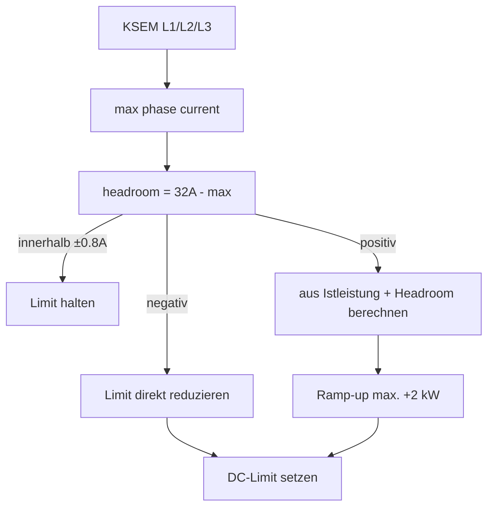

# LoadManager

Der native LoadManager regelt die **DC-Ladeleistung der QC45 anhand der höchsten KSEM-Phasenstrombelastung**.

## Aktueller Stand

> [!IMPORTANT]
> Version 1.0 ist **DC-only**. Connector 3 / Type2 wird weder erkannt noch aktiv geregelt. Sein Verbrauch ist aber im KSEM enthalten und reduziert dadurch automatisch den für DC verfügbaren Headroom.

## Standardwerte

| Parameter | Wert |
|---|---:|
| Zielstrom | `32.0 A` |
| Hysterese | `0.8 A` |
| DC Minimum | `5 kW` |
| DC Maximum | `50 kW` |
| Ramp-up | `2 kW / Regelzyklus` |
| Regelintervall | `1000 ms` |
| Failback-Guard | standardmäßig `34 A` |

## Regelprinzip



Für die Umrechnung wird bei 400 V Drehstrom verwendet:

```text
1 A ≈ √3 × 400 V / 1000 = 0,69282 kW
```

### Hochregeln

```text
requested_kW = actualDc_kW + headroom_A × 0,69282
```

Das Ergebnis wird begrenzt und darf pro Zyklus höchstens um `rampUpKwPerLoop` steigen.

### Herunterregeln

Bei negativem Headroom wird vom **bereits freigegebenen** Budget reduziert. Eine Abregelung wird nicht durch den Ramp-up-Limiter verzögert.

## Start-Sicherheitslogik

Ein entscheidender Fix war die Race Condition **5 kW → 50 kW beim Sessionstart**. Daher gilt heute:

1. Im Idle werden beide DC-Ausgänge kontinuierlich auf `minDcKw` vorgerüstet.
2. `commandedDcKw` ist der autoritative, tatsächlich freigegebene Wert.
3. Meldet EVCSD intern plötzlich einen höheren Wert, wird dieser sofort wieder auf `commandedDcKw` zurückgesetzt.
4. Erst danach darf kontrolliert hochgerampt werden.

## Zweite Schutzschwelle

Schon der LoadManager selbst reagiert ab `failbackGuardA` und zwingt DC auf Minimum. Damit existiert zusätzlich zum separaten `GridFailback` ein unabhängiger schneller Reduktionspfad.

## Session-Erkennung

DC aktiv, wenn bei Connector 1 oder 2 entweder:

- Leistung > 0 oder
- ein ID-Tag/User-Kontext vorhanden ist.

Bei Sessionende wird wieder auf 5 kW vorgerüstet.

Quellcode: `https://github.com/BugUser0815/QC45/blob/native-integration/native-integration/src/main/java/de/rothner/qc45/LoadManager.java`

Siehe auch: [Grid-Failback](Grid-Failback), [KSEM-Anbindung](KSEM-Anbindung).
