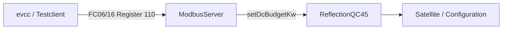

# Modbus TCP

`ModbusServer.java` stellt die QC45 als **Multi-Client-Modbus/TCP-Server** bereit. Standardport ist `1502`.

> [!NOTE]
> Der Server läuft **im EVCSD/Tomcat-Prozess**. Er liest keine zweite Datenquelle, sondern verwendet die bereits vorhandenen EVCSD-Liveobjekte über `ReflectionQC45`.

## Unterstützte Funktionen

- FC03 – Read Holding Registers
- FC04 – Read Input Registers (gleiche Registerabbildung)
- FC06 – Write Single Register
- FC16 – Write Multiple Registers

Nur Register **110 und 111** sind beschreibbar. Alle anderen Schreibversuche liefern Modbus Exception `02`.

## Registerübersicht

| Register | R/W | Bedeutung | Einheit |
|---:|:---:|---|---|
| 0 | R | Gesamtleistung Station | kW |
| 1 | R | Connector 1 / CHAdeMO Leistung | kW |
| 2 | R | Connector 2 / CCS Leistung | kW |
| 3 | R | Connector 3 / Type2 Leistung | kW |
| 4 | R | aktiver DC-Connector (`0/1/2`) | – |
| 10 | R | Limit Connector 1 | kW |
| 11 | R | Limit Connector 2 | kW |
| 12 | R | Limit Connector 3 | kW |
| 20 | R | Session Connector 1 aktiv | 0/1 |
| 21 | R | Session Connector 2 aktiv | 0/1 |
| 22 | R | Session Connector 3 aktiv | 0/1 |
| 30 | R | `remoteStarted` | 0/1 |
| 40 | R | `Configuration.maxPower` | kW |
| 41 | R | `Configuration.maxPowerAC` | kW |
| 50–51 | R | Energie Connector 1, U32 high/low | Wh |
| 52–53 | R | Energie Connector 2, U32 high/low | Wh |
| 54–55 | R | Energie Connector 3, U32 high/low | Wh |
| 60 | R | Gesamtstatus: 0 idle, 1 Session, 2 Charging | – |
| 100 | R | Leistung aktiver DC-Ausgang | kW |
| 101 | R | Type2-Leistung | kW |
| **110** | **R/W** | **DC-Budget** | **kW** |
| **111** | **R/W** | **AC/Type2-Budget** | **kW** |
| 120 | R | Live-DC-Leistung für Lademonitor | kW |
| 121 | R | DC-Soll/Limit für Lademonitor | kW |
| 122 | R | Batterie-SoC aus `SatelliteInfo` | % |
| 123 | R | Ladezeit | s |
| 124–125 | R | Sessionenergie U32 high/low | Wh |

## Aktiver DC-Connector

Connector 1 und 2 sind als logische DC-Ausgänge behandelt. Sind beide Zustände gleichzeitig plausibel, wird der Ausgang mit der höheren aktuellen Leistung gewählt. Ohne Leistung wird zusätzlich geprüft, ob eine Transaktion bzw. ID-Tag-Aktivität vorliegt.

## Schreibpfad

Register 110 steuert den DC-Budgetpfad, Register 111 den AC-Budgetpfad. Der native **LoadManager schreibt nicht über den Netzwerk-Modbus-Server**, sondern ruft denselben `ReflectionQC45`-Pfad direkt auf.

## Warum Multi-Client?

Parallel können evcc, die lokale UI und Diagnosewerkzeuge lesen. Jeder Client erhält einen eigenen Thread und Socket. Das vermeidet, dass ein lang laufender Client alle anderen blockiert.

Quellcode: `https://github.com/BugUser0815/QC45/blob/native-integration/native-integration/src/main/java/de/rothner/qc45/ModbusServer.java`

Siehe auch: [EVCC Integration](EVCC-Integration), [Lademonitor UI](Lademonitor-UI).
