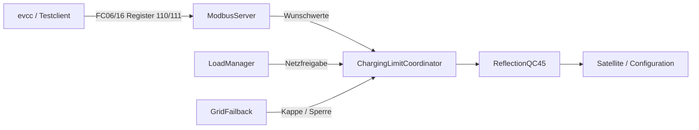

# Modbus TCP

`ModbusServer.java` stellt die QC45 als **Multi-Client-Modbus/TCP-Server** bereit. Standardport ist `1502`.

> [!NOTE]
> Der Server läuft **im EVCSD/Tomcat-Prozess**. Er liest keine zweite Datenquelle, sondern verwendet die bereits vorhandenen EVCSD-Liveobjekte über `ReflectionQC45`.

## Unterstützte Funktionen

- FC03 – Read Holding Registers
- FC04 – Read Input Registers (gleiche Registerabbildung)
- FC06 – Write Single Register
- FC16 – Write Multiple Registers

Nur Register **110 und 111** sind beschreibbar. Alle anderen Schreibversuche liefern Modbus Exception `02`.

## Registerübersicht

| Register | R/W | Bedeutung | Einheit |
|---:|:---:|---|---|
| 0 | R | Gesamtleistung Station | kW |
| 1 | R | Connector 1 / CHAdeMO Leistung | kW |
| 2 | R | Connector 2 / CCS Leistung | kW |
| 3 | R | Connector 3 / Type2 Leistung | kW |
| 4 | R | aktiver DC-Connector (`0/1/2`) | – |
| 10 | R | Limit Connector 1 | kW |
| 11 | R | Limit Connector 2 | kW |
| 12 | R | Limit Connector 3 | kW |
| 20 | R | Session Connector 1 aktiv | 0/1 |
| 21 | R | Session Connector 2 aktiv | 0/1 |
| 22 | R | Session Connector 3 aktiv | 0/1 |
| 30 | R | `remoteStarted` | 0/1 |
| 40 | R | `Configuration.maxPower` | kW |
| 41 | R | `Configuration.maxPowerAC` (native Type2-Pilotstrom; aktiver Grenzwert steht in `ACMaxPowerFixed`) | A |
| 50–51 | R | Energie Connector 1, U32 high/low | Wh |
| 52–53 | R | Energie Connector 2, U32 high/low | Wh |
| 54–55 | R | Energie Connector 3, U32 high/low | Wh |
| 60 | R | Gesamtstatus: 0 idle, 1 Session, 2 Charging | – |
| 100 | R | Leistung aktiver DC-Ausgang | kW |
| 101 | R | Type2-Leistung | kW |
| **110** | **R/W** | **dauerhafte evcc-DC-Obergrenze** | **kW** |
| **111** | **R/W** | **dauerhafte evcc-AC-Obergrenze** | **kW** |
| 120 | R | Live-DC-Leistung für Lademonitor | kW |
| 121 | R | logisches DC-Soll für Lademonitor (`0` bei physischem 5-kW-Notladen) | kW |
| 122 | R | Batterie-SoC aus `SatelliteInfo` | % |
| 123 | R | Ladezeit | s |
| 124–125 | R | Sessionenergie U32 high/low | Wh |
| 126 | R | AC/DC-UI-Schema-Version (`1`) | – |
| 127 | R | AC/DC-Session-, Leistungs- und Schutzflags | Bitfeld |
| 128 | R | aktiver DC-Connector (`0/1/2`) | – |
| 129 | R | DC-Istleistung | kW |
| 130 | R | evcc-DC-Anforderung | kW |
| 131 | R | LoadManager-DC-Zuteilung | kW |
| 132 | R | GridFailback-DC-Schutzkappe | kW |
| 133 | R | wirksame DC-Freigabe | kW |
| 134 | R | DC-Fahrzeug-SoC | % |
| 135 | R | DC-Ladezeit | s |
| 136–137 | R | DC-Sessionenergie U32 high/low | Wh |
| 138 | R | AC-Istleistung | kW |
| 139 | R | evcc-AC-Anforderung | kW |
| 140 | R | LoadManager-AC-Zuteilung | kW |
| 141 | R | GridFailback-AC-Schutzkappe | kW |
| 142 | R | wirksame AC-Freigabe | kW |
| 143 | R | AC-Ladezeit | s |
| 144–145 | R | AC-Sessionenergie U32 high/low | Wh |
| 146 | R | Länge der aktuellen DC-RFID-/OCPP-Kennung | Byte |
| 147–162 | R | aktuelle DC-RFID-/OCPP-Kennung, 32 ASCII-Bytes, zwei Bytes je Register | ASCII |
| 163 | R | Länge der aktuellen Type2-RFID-/OCPP-Kennung | Byte |
| 164–179 | R | aktuelle Type2-RFID-/OCPP-Kennung, 32 ASCII-Bytes, zwei Bytes je Register | ASCII |
| 180–182 | R | DC L1/L2/L3, dreiphasiges 400-V-Stromäquivalent | 0,1 A |
| 183–185 | R | Type2 L1/L2/L3, dreiphasiges 400-V-Stromäquivalent | 0,1 A |

Register 127 verwendet folgende Bits:

| Bit | Bedeutung |
|---:|---|
| 0/1 | DC-/AC-Session aktiv |
| 2/3 | DC-/AC-Leistungsfluss aktiv |
| 4 | zentrale Sperre aktiv |
| 5 | GridFailback-Sperre |
| 6 | KSEM-/LoadManager-Sperre |
| 7 | sichere Startsperre |
| 8 | Shutdown-Sperre |
| 9 | bedarfsgerechte Umverteilung aktiv |
| 10 | reduzierte GridFailback-Schutzkappe aktiv |
| 11 | ungültige Sicherheitskonfiguration; Laden bleibt gesperrt |
| 12 | gemessene Leistung trotz wirksamer 0-kW-Freigabe; Notabschaltung verriegelt |

## evcc-Telemetrie

Die Kennung in 146–179 kommt direkt aus dem von EVCSD gehaltenen `idTag` und kann damit in evcc über `api.Identifier` als RFID-Kennung dargestellt werden. Für den logischen DC-Lader wird bevorzugt der aktive CHAdeMO-/CCS-Connector verwendet; ohne aktiven DC-Connector wird eine noch vorhandene Kennung von Connector 1 oder 2 geliefert.

Die Stromwerte 180–185 sind **keine zusätzlichen Messwerte eines internen Phasenzählers**. Da die vorhandene EVCSD-Schnittstelle auf allen bekannten Softwareständen keine verlässlich nachgewiesenen L1/L2/L3-Ströme bereitstellt, werden sie aus der jeweiligen Live-Leistung als symmetrisches dreiphasiges 400-V-Äquivalent berechnet (`I = P / (sqrt(3) × 400 V)`). Sie dienen ausschließlich der evcc-Anzeige und werden weder für GridFailback noch für das Loadmanagement verwendet.

## Aktiver DC-Connector

Connector 1 und 2 sind als logische DC-Ausgänge behandelt. Sind beide Sessions gleichzeitig aktiv, wird der Ausgang mit der höheren aktuellen Leistung gewählt. Ohne Leistung ist die aktive EVCSD-Transaktion maßgeblich; eine ID-Tag-Aktivität dient nur auf älteren Firmwareständen ohne Transaktions-API als Fallback.

## Schreibpfad

Register 110 steuert die persistente DC-Anforderung, Register 111 die
AC-Anforderung. Werte `1..4 kW` werden wie `0 kW` als Pause behandelt. Modbus
schreibt nie mehr direkt in EVCSD und kann deshalb eine Failback-Sperre nicht
überschreiben. FC16-Schreibvorgänge auf 110/111 werden atomar übernommen;
Hardware-Reduktionen erfolgen vor Erhöhungen.

Beim JVM-/Webapp-Start zeigen beide Wunschregister zunächst das konfigurierte
Ausgangsmaximum. Solange kein Schreibzugriff erfolgt, ist das die autonome
Obergrenze des nativen LoadManagers. Der erste Schreibzugriff übernimmt nur den
betreffenden Ausgang für evcc; `0 kW` bleibt danach eine explizite Pause. Die
Station startet unabhängig davon hardwareseitig bei 0 kW und gibt erst nach
gültiger KSEM-Prüfung ein netzsicheres Ziel frei.

## Warum Multi-Client?

Parallel können evcc, die lokale UI und Diagnosewerkzeuge lesen. Jeder Client erhält einen eigenen Thread und Socket. Das vermeidet, dass ein lang laufender Client alle anderen blockiert.

Der Zugriff ist dennoch nicht offen: `modbus.allowedClients` enthält eine
kommaseparierte Liste exakter IP-Adressen oder CIDR-Netze, zusätzlich ist
Loopback erlaubt. Wildcards und Hostnamen werden abgelehnt; eine leere Liste
bedeutet `loopback-only`. `modbus.maxClients` begrenzt parallele Sockets.

Jeder Read-Request verwendet einen zusammenhängenden Snapshot. Dadurch stammen
AC/DC-Leistungen, evcc-Wünsche, LoadManager-Zuteilungen, wirksame Freigaben,
Sicherheitsstatus, SoC, Zeiten sowie High-/Low-Wörter beider Energiewerte aus
demselben Abfragezustand.

Quellcode: `https://github.com/BugUser0815/QC45/blob/native-integration/native-integration/src/main/java/de/rothner/qc45/ModbusServer.java`

Siehe auch: [EVCC Integration](EVCC-Integration), [Lademonitor UI](Lademonitor-UI).
