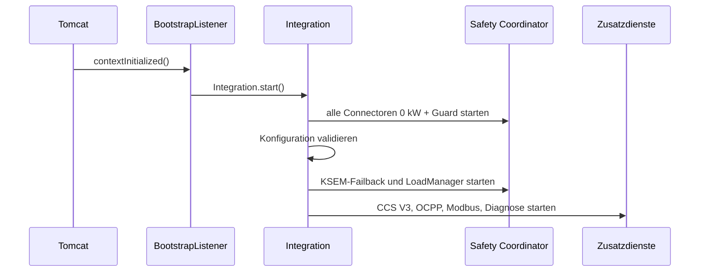

# Native Integration

Die native Integration ersetzt mehrere frühere externe Hilfsprozesse durch **ein Java-7-JAR innerhalb derselben Tomcat/JVM wie EVCSD**.

## Ziel

- direkter Zugriff auf `CentralModule`, `SatelliteModule` und `Configuration`
- keine JSP-Schreibpfade für die Leistungsregelung
- kein separater Python-OCPP-Prozess
- ein lokaler Modbus/TCP-Endpunkt für evcc und UI
- Failback, LoadManager und Diagnose direkt an der Stationslogik

## Startpfad

`BootstrapListener` wird in der bestehenden `web.xml` registriert. Beim Start passiert vereinfacht:



Fehlt die Konfiguration oder ist sie ungültig, bleibt der bereits gestartete
`ChargingLimitGuard` im **Degraded Safe Mode** aktiv und setzt alle drei
Connectoren weiterhin auf 0 kW. OCPP- oder CCS-Fehler können den Netzschutz
nicht mehr am Start hindern.

## Von `Integration` gestartete Komponenten

| Komponente | Funktion |
|---|---|
| `ReflectionQC45` | Adapter auf die laufenden EVCSD-Objekte |
| `ChargingLimitCoordinator` | einzige Schreibinstanz für alle AC/DC-Limits |
| `ChargingLimitGuard` | 250-ms-Reconcile und fail-closed Start/Shutdown |
| `ModbusServer` | zugriffsbeschränktes Multi-Client Modbus/TCP, Port 1502 |
| `OcppBridgeClient` | OCPP 1.6 JSON/WSS zum Backend |
| `Ocpp15BridgeServer` | lokaler OCPP-1.5-SOAP-zu-1.6-Bridge-Endpunkt |
| `LoadManager` | gemeinsames, gleich priorisiertes DC/AC-Budget nach KSEM-Phasenstrom |
| `GridFailback` | unabhängige AC/DC-Schutzebene am Netzlimit |
| `EvcsdLagMonitor` | EVCSD-Executor-Watchdog |
| `RemoteStartAuthorizationFix` | connectorbezogene CCS-Remote-Autorisierung |

## Reflection statt Firmware-Patch

`ReflectionQC45` greift auf bereits im Original-EVCSD vorhandene Objekte zu. Dadurch bleiben die Original-JARs grundsätzlich unangetastet; die Anpassung lebt als zusätzliche Bibliothek in `WEB-INF/lib`.

Das ist besonders wichtig für:

- Leistungswerte und Limits der Satelliten
- `CentralModule.remoteStarted` / `loggedIn`
- aktive Transaktionen
- Energiezähler und `SatelliteInfo`
- `Configuration.maxPower`, `maxPowerAC`, `DCMaxPowerFixed`, `ACMaxPowerFixed`

## Persistentes Logging

`BootstrapListener` installiert `FileLog` nach:

```text
/home/mobie/evcsd/qc45-integration.log
```

Die Originalausgaben bleiben gleichzeitig auf dem bisherigen Tomcat-Stream
sichtbar. Beim Webapp-Shutdown werden `System.out`/`System.err` sauber
wiederhergestellt. Ab 10 MiB rotiert das Log beim nächsten Start in bis zu drei
Vorversionen.

## Aktueller Grundsatz

> [!IMPORTANT]
> Die Integration soll die Originalzustände nur dort spiegeln oder überschreiben, wo dies für die konkrete Funktion nötig ist. Historische „Hardware-Metadata“- oder Stromfeld-Experimente werden bewusst **nicht** beim Bootstrap angewendet.

Quellcode: `https://github.com/BugUser0815/QC45/tree/native-integration/native-integration/src/main/java/de/rothner/qc45`

Siehe auch: [Modbus TCP](Modbus-TCP), [OCPP Bridge](OCPP-Bridge), [Build & Installation](Build-und-Installation).
