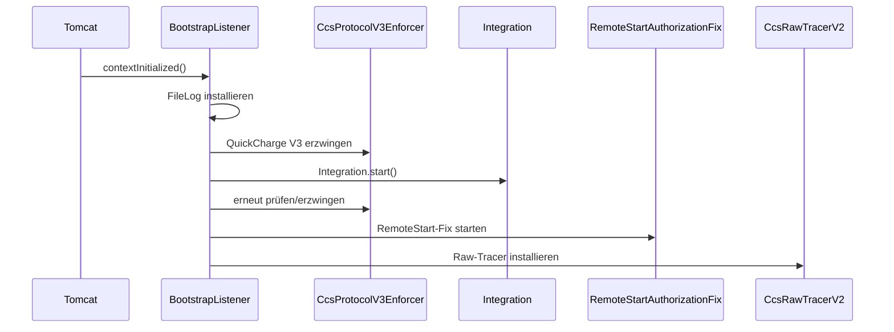

# Native Integration

Die native Integration ersetzt mehrere frühere externe Hilfsprozesse durch **ein Java-7-JAR innerhalb derselben Tomcat/JVM wie EVCSD**.

## Ziel

- direkter Zugriff auf `CentralModule`, `SatelliteModule` und `Configuration`
- keine JSP-Schreibpfade für die Leistungsregelung
- kein separater Python-OCPP-Prozess
- ein lokaler Modbus/TCP-Endpunkt für evcc und UI
- Failback, LoadManager und Diagnose direkt an der Stationslogik

## Startpfad

`BootstrapListener` wird in der bestehenden `web.xml` registriert. Beim Start passiert vereinfacht:



## Von `Integration` gestartete Komponenten

| Komponente | Funktion |
|---|---|
| `ReflectionQC45` | Adapter auf die laufenden EVCSD-Objekte |
| `ModbusServer` | Multi-Client Modbus/TCP, Standardport 1502 |
| `OcppBridgeClient` | OCPP 1.6 JSON/WSS zum Backend |
| `Ocpp15BridgeServer` | lokaler OCPP-1.5-SOAP-zu-1.6-Bridge-Endpunkt |
| `LoadManager` | DC-Leistungsregelung nach KSEM-Phasenstrom |
| `GridFailback` | unabhängige Schutzebene |
| `EvcsdLagMonitor` | EVCSD-Executor-Watchdog |

## Reflection statt Firmware-Patch

`ReflectionQC45` greift auf bereits im Original-EVCSD vorhandene Objekte zu. Dadurch bleiben die Original-JARs grundsätzlich unangetastet; die Anpassung lebt als zusätzliche Bibliothek in `WEB-INF/lib`.

Das ist besonders wichtig für:

- Leistungswerte und Limits der Satelliten
- `CentralModule.remoteStarted` / `loggedIn`
- aktive Transaktionen
- Energiezähler und `SatelliteInfo`
- `Configuration.maxPower`, `maxPowerAC`, `DCMaxPowerFixed`, `ACMaxPowerFixed`

## Persistentes Logging

`BootstrapListener` installiert `FileLog` nach:

```text
/home/mobie/evcsd/qc45-integration.log
```

Damit bleiben Diagnoseausgaben auch dann erhalten, wenn die ursprüngliche EVCSD-Logging-Konfiguration unpraktisch ist.

## Aktueller Grundsatz

> [!IMPORTANT]
> Die Integration soll die Originalzustände nur dort spiegeln oder überschreiben, wo dies für die konkrete Funktion nötig ist. Historische „Hardware-Metadata“- oder Stromfeld-Experimente werden bewusst **nicht** beim Bootstrap angewendet.

Quellcode: `https://github.com/BugUser0815/QC45/tree/native-integration/native-integration/src/main/java/de/rothner/qc45`

Siehe auch: [Modbus TCP](Modbus-TCP), [OCPP Bridge](OCPP-Bridge), [Build & Installation](Build-und-Installation).
