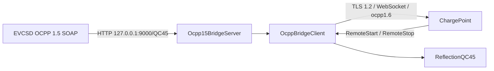

# OCPP Bridge

Die produktive Integration lässt das alte EVCSD weiterhin **OCPP 1.5 SOAP** sprechen, setzt davor aber einen lokalen Übersetzer auf **OCPP 1.6 JSON über WSS** zum ChargePoint-Backend.

## Datenpfad



## Standard-Loopback

```text
Bind: 127.0.0.1
Port: 9000
Path: /QC45
```

Damit bleibt die Legacy-Schnittstelle ausschließlich lokal erreichbar.

## SOAP → JSON weitergeleitete Operationen

Der aktuelle Bridge-Server behandelt unter anderem:

- BootNotification
- Heartbeat
- Authorize
- StatusNotification
- StartTransaction
- MeterValues
- StopTransaction
- FirmwareStatusNotification
- DiagnosticsStatusNotification
- DataTransfer

Transaktions-IDs werden dem jeweiligen Connector zugeordnet, damit ein Backend-`RemoteStopTransaction` auf den richtigen QC45-Ausgang geführt werden kann.

## Statuskorrektur

Das alte EVCSD meldet Zustände nicht immer passend zur OCPP-1.6-Semantik. Die Bridge leitet deshalb Status aus Livezuständen ab:

- Leistung > 0 → `Charging`
- aktive Transaktion, Limit = 0 → `SuspendedEVSE`
- aktive Transaktion, keine Leistung, Limit > 0 → `SuspendedEV`
- nach Stop → best effort `Finishing`

Ein eingehendes OCPP-1.5-`Occupied` wird in Richtung 1.6 zunächst als `Preparing` behandelt.

## Backend-Kommandos

`OcppBridgeClient` akzeptiert aktuell:

| OCPP 1.6 CALL | Verhalten |
|---|---|
| `RemoteStartTransaction` | an `ReflectionQC45.remoteStart()` |
| `RemoteStopTransaction` | anhand gemerkter Transaktion an richtigen Connector |
| `Reset` | `Rejected` |
| `UnlockConnector` | `NotSupported` |

## Transport

- ausschließlich `wss://`
- TLS 1.2
- Basic Authentication
- WebSocket Subprotocol `ocpp1.6`
- CA-Datei konfigurierbar
- optional `tls.insecure=true` für Diagnose, nicht für Normalbetrieb empfohlen
- Reconnect mit exponentiellem Backoff bis 30 s

Quellcode:

- `https://github.com/BugUser0815/QC45/blob/native-integration/native-integration/src/main/java/de/rothner/qc45/Ocpp15BridgeServer.java`
- `https://github.com/BugUser0815/QC45/blob/native-integration/native-integration/src/main/java/de/rothner/qc45/OcppBridgeClient.java`

Siehe auch: [RemoteStart & Autorisierung](RemoteStart-und-Autorisierung).
