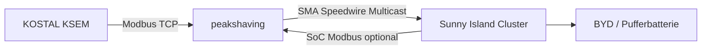

# Peak Shaving & Sunny Island

Das Sunny-Island-Peak-Shaving ist **kein Bestandteil des QC45-JARs**, sondern ein separater C++-Prozess im Repository `BugUser0815/PeakShaving`, Branch **`lean`**.

## Zweck

Der Prozess liest die reale Netzsituation am KOSTAL KSEM und erzeugt daraus ein **virtuelles SMA Energy Meter** per Speedwire Multicast. Der Sunny-Island-Cluster reagiert auf diese künstliche Netzleistung und lädt bzw. entlädt die Pufferbatterie.



## Aktuelle statische Regelung

Der aktuelle `lean`-Stand wurde bewusst wieder auf die ursprüngliche **statische Beziehung** zurückgeführt:

```text
net = real_import - real_export
```

Ist `net < peakTarget`, wird ein künstlicher Export erzeugt:

```text
fake_export = peakTarget - net
fake_import = 0
```

Ist `net >= peakTarget`, wird ein künstlicher Import erzeugt:

```text
fake_import = net - peakTarget
fake_export = 0
```

Standard-Peak-Ziel: **11.000 W**.

## Sonderfall reale Einspeisung / keine Last

Genau hier lag ein wichtiger Bug: Bei sehr kleiner oder negativer realer Netzlast durfte der Speicher **nicht ohne reale Last entladen**. Gleichzeitig musste der Fake-Export erhalten bleiben, weil dieser die gewünschte Beladung der Batterie auslöst.

Der aktuelle Stand berechnet daher konsequent aus **Import minus Export**. Reale Einspeisung wird nicht als Last behandelt; stattdessen steigt der virtuelle Export entsprechend an.

Beispiel bei `peakTarget = 11 kW`:

```text
real net = 0 kW  -> fake export = 11 kW
real net = -2 kW -> fake export = 13 kW
real net = 8 kW  -> fake export = 3 kW
real net = 15 kW -> fake import = 4 kW
```

## Warum der zwischenzeitliche Integrator verworfen wurde

Ein experimenteller Stand akkumulierte `fakeW += errorW`. Das führte in Sonderfällen zu unerwünschtem Speicherverhalten und war nicht die ursprünglich funktionierende Regelung. Deshalb wurde er zurückgenommen.

## Performance

`lean` ersetzt den alten Python+C++-Dateipfad:

- kein Python/pymodbus
- keine RAM-Disk-Zwischendatei
- kein Textparsing
- vier zusammenhängende KSEM-Modbus-Blöcke pro Zyklus
- direkte Erzeugung des 608-Byte-SMA-eMeter-Pakets
- Zyklus ungefähr 1 s

Repository: `https://github.com/BugUser0815/PeakShaving/tree/lean`

Siehe auch: [SoC-Derating](SoC-Derating), [KSEM-Anbindung](KSEM-Anbindung).
