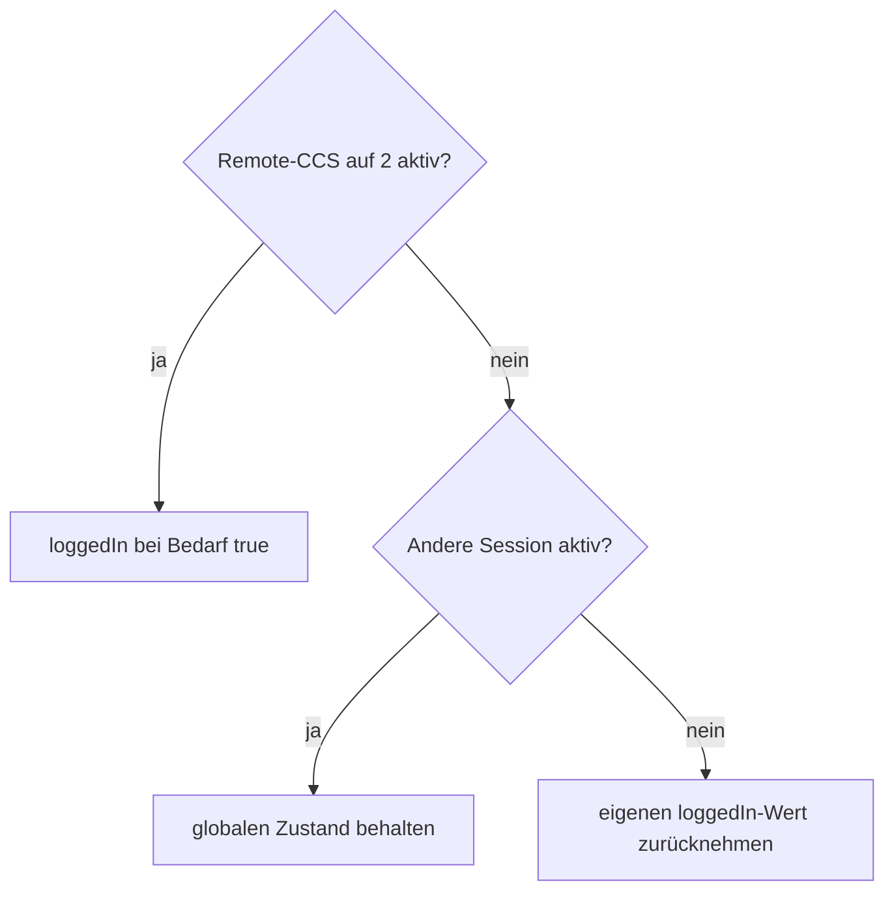

# RemoteStart & Autorisierung

Beim CCS-RemoteStart zeigte sich eine EVCSD-spezifische Besonderheit: Der ursprüngliche CCS-V3-Zustandsautomat benötigt während einer RemoteStart-Session weiterhin einen passenden `loggedIn`-Zustand.

## Lösung

`RemoteStartAuthorizationFix` überwacht alle **100 ms**:

```text
Connector 2 ist von dieser Integration remote gestartet
AND Connector 2 hat eine aktive Session
AND Connector 2 ist aktuell CCS
```

Sind alle Bedingungen wahr und `loggedIn` ist false, wird `loggedIn=true`
gespiegelt. Der von der Integration gesetzte globale Zustand wird erst dann auf
false zurückgenommen, wenn **keine AC- oder DC-Session mehr aktiv ist**.



## Warum so eng begrenzt?

Der Fix soll **keine globale Offline-Autorisierung simulieren**. Er greift nur für den bekannten Problemfall:

- RemoteStart aktiv
- Connector 2
- CCS

Dadurch bleibt die Original-EVCSD-Autorisierungslogik für lokale Kartenstarts,
CHAdeMO und Type2 weitgehend unangetastet. Insbesondere kann das Ende einer
Remote-CCS-Session nicht mehr die Autorisierung eines gleichzeitig ladenden
Type2- oder CHAdeMO-Fahrzeugs zurücksetzen.

## Bezug zum V3-START-Paket

Der Login-/Autorisierungszustand beeinflusst die Flags des internen EFACEC-`0x63`-START-Telegramms. Der Leistungswert selbst bleibt davon getrennt und wird als `maxPower` in kW übertragen.

Quellcode: `https://github.com/BugUser0815/QC45/blob/native-integration/native-integration/src/main/java/de/rothner/qc45/RemoteStartAuthorizationFix.java`

Siehe auch: [CCS QuickCharge V3](CCS-QuickCharge-V3), [OCPP Bridge](OCPP-Bridge).
