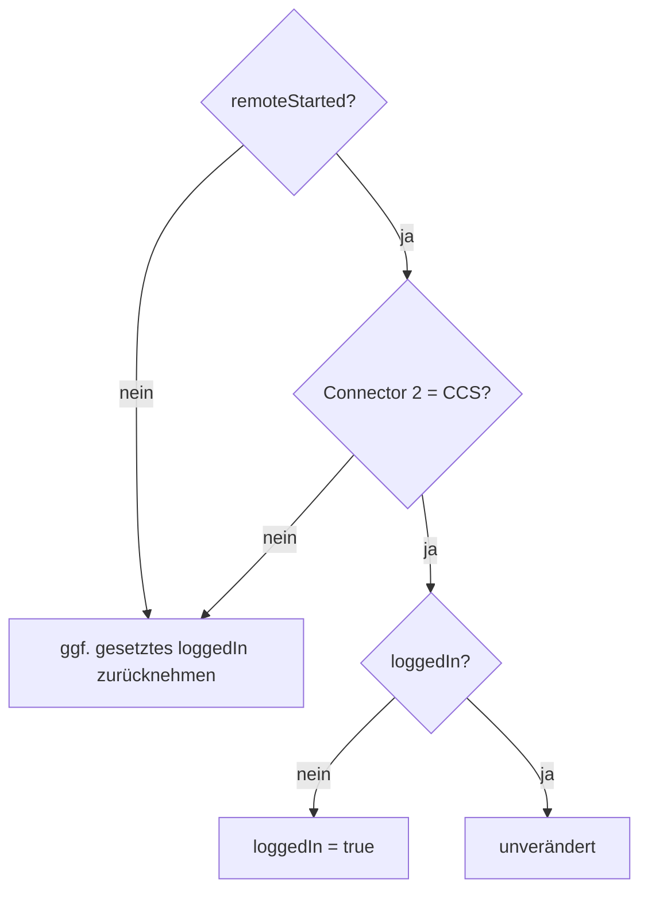

# RemoteStart & Autorisierung

Beim CCS-RemoteStart zeigte sich eine EVCSD-spezifische Besonderheit: Der ursprüngliche CCS-V3-Zustandsautomat benötigt während einer RemoteStart-Session weiterhin einen passenden `loggedIn`-Zustand.

## Lösung

`RemoteStartAuthorizationFix` überwacht alle **100 ms**:

```text
CentralModule.isRemoteStarted()
AND
Connector 2 ist aktuell CCS
```

Sind beide Bedingungen wahr und `loggedIn` ist false, wird `loggedIn=true` gespiegelt. Sobald RemoteStart oder CCS-Auswahl endet, wird der von der Integration gesetzte Zustand wieder auf false zurückgenommen.



## Warum so eng begrenzt?

Der Fix soll **keine globale Offline-Autorisierung simulieren**. Er greift nur für den bekannten Problemfall:

- RemoteStart aktiv
- Connector 2
- CCS

Dadurch bleibt die Original-EVCSD-Autorisierungslogik für lokale Kartenstarts, CHAdeMO und Type2 weitgehend unangetastet.

## Bezug zum V3-START-Paket

Der Login-/Autorisierungszustand beeinflusst die Flags des internen EFACEC-`0x63`-START-Telegramms. Der Leistungswert selbst bleibt davon getrennt und wird als `maxPower` in kW übertragen.

Quellcode: `https://github.com/BugUser0815/QC45/blob/native-integration/native-integration/src/main/java/de/rothner/qc45/RemoteStartAuthorizationFix.java`

Siehe auch: [CCS QuickCharge V3](CCS-QuickCharge-V3), [OCPP Bridge](OCPP-Bridge).
