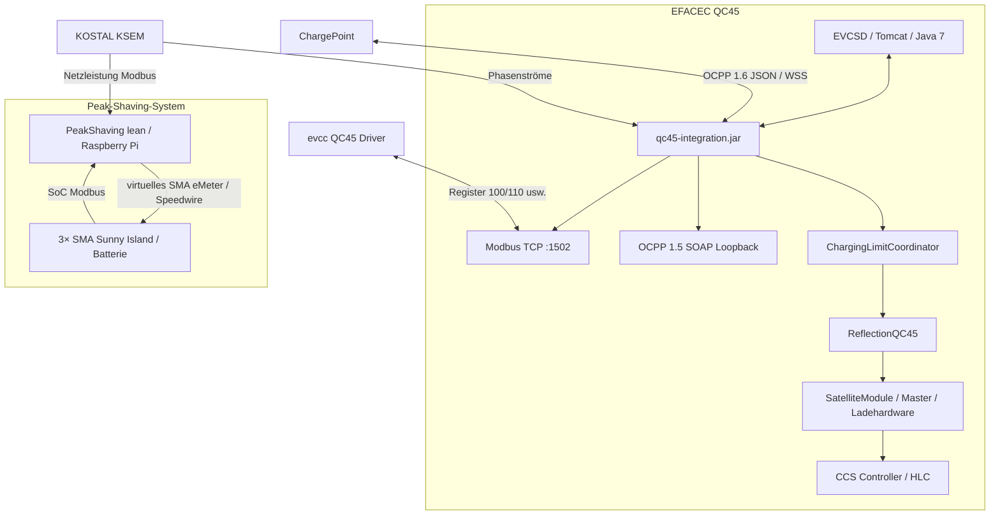

# Systemarchitektur

Die heutige Lösung besteht aus **drei getrennten Regel- und Integrationsbereichen**: QC45/EVCSD, EVCC/OCPP sowie dem externen Sunny-Island-Peak-Shaving. Diese Trennung ist wichtig, weil ein Fehler in einer Ebene nicht automatisch in einer anderen Ebene liegt.

## Gesamtbild



## Zuständigkeiten

| Komponente | Zuständigkeit | Absichtlich **nicht** zuständig für |
|---|---|---|
| EVCSD | Originale Stationslogik, Transaktionen, Hardwarezustände | externes Peak Shaving |
| `qc45-integration.jar` | OCPP-Bridge, Modbus, LoadManager, GridFailback, Diagnose | Sunny-Island-Speedwire |
| evcc | optionale dauerhafte AC/DC-Wunschobergrenzen ab dem ersten Schreibzugriff | Netzfreigabe oder OCPP-Transaktionsstart |
| LoadManager | gemeinsames, gleich priorisiertes DC/AC-Budget nach KSEM-Phasenstrom | externes Peak Shaving |
| GridFailback | unabhängiger AC/DC-Überstrom- und Messausfallschutz | normale Leistungsoptimierung |
| ChargingLimitCoordinator | Minimum aus evcc-Wunsch, Netzfreigabe und Schutzkappe; einzige Hardware-Schreibinstanz | eigene Messung oder Optimierung |
| PeakShaving `lean` | virtuelles SMA eMeter für Sunny Island | QC45 direkt ansteuern |
| SoC-Limiter | positive Entladeanforderung des Sunny Island begrenzen | Fake-Export/Ladeanforderung begrenzen |

## Zwei verschiedene „Modbus“-Rollen

1. **QC45 als Modbus-Server:** `qc45-integration.jar` lauscht auf Port `1502`. evcc und lokale UI lesen bzw. schreiben dort QC45-Daten.
2. **QC45/PeakShaving als Modbus-Client:** LoadManager/GridFailback lesen den KSEM auf Port `502`; der PeakShaving-Prozess liest KSEM und optional Sunny Island ebenfalls per Modbus.

Diese Rollen dürfen nicht vermischt werden.

Die wirksame Freigabe ist immer:

```text
P_effektiv = min(P_evcc, P_LoadManager, P_Failback)
```

Eine Failback-Sperre kann weder durch evcc noch durch EVCSD überschrieben
werden. Der unabhängige Guard erkennt und korrigiert fremde EVCSD-Limitwrites
spätestens im nächsten 250-ms-Zyklus.

## CCS-Protokollebenen

```mermaid
flowchart LR
  JAVA[EVCSD Java] -->|EFACEC QuickCharge V3\n0x63 … maxPower[kW]| MASTER[EFACEC Master]
  MASTER -->|serieller QuickCharge-Pfad| SECC[CCS Controller]
  SECC -->|PLC / DIN 70121 / ISO 15118| CAR[Fahrzeug]
```

Das interne **EFACEC CCS V2/V3** ist **nicht** die Protokollversion, die das Fahrzeug per PLC aushandelt. Diese Unterscheidung war zentral bei der Kona-Analyse.

## Repositories

- QC45 Integration: `https://github.com/BugUser0815/QC45/tree/native-integration`
- Peak Shaving: `https://github.com/BugUser0815/PeakShaving/tree/lean`
- EVCC-Fork: `https://github.com/BugUser0815/evcc/tree/QC45`

Siehe auch: [Native Integration](Native-Integration), [LoadManager](LoadManager), [Peak Shaving](Peak-Shaving-und-Sunny-Island), [CCS QuickCharge V3](CCS-QuickCharge-V3).
